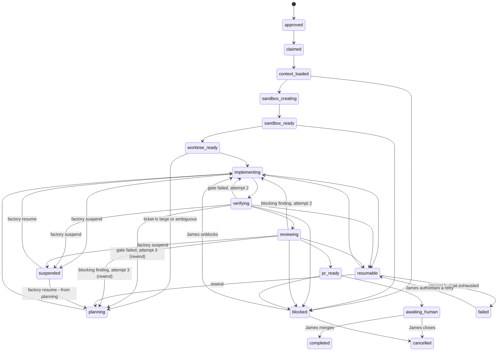

# Software Factory — Implementation Plan

Status: **plan only**. Nothing in this document has been implemented. No repository was
modified, no branch created, no PR opened, no Linear object touched, no sandbox created.

Author: planning agent · Date: 2026-08-20 · Target executor: a separate execution agent.

Every command, flag, file path and label in this document was verified against the local
CLIs, the fetched `origin/v2` and `origin/main` refs, and the Obsidian notes on the date
above. Where verification was impossible, the item is marked **UNVERIFIED** and carries a
Phase 0 discovery step. The executing agent must not invent a substitute for anything
marked UNVERIFIED.

---

## 1. Goal

Build a deterministic control plane — the **factory** — that owns the automated software
development lifecycle for one approved Linear ticket, from claim through to a pull request
that waits for James.

The factory's job is not to be clever. It is to be a machine that:

1. survives a crash and resumes the ticket it was on,
2. never repeats a side effect on resume,
3. never performs a decision this plan reserves for James,
4. produces evidence that a human can audit without re-running anything,
5. reuses the existing harness for gates, review frames and enforcement instead of
   authoring a second copy of them.

Explicit non-goals for the MVP: distributed execution, multi-machine scheduling, a swarm of
peer agents, auto-merge, deployment, and any hosted sandbox. Each is deferred with a named
trigger in §19 and §23.

### 1.1 What was verified, and how

| Claim | How it was checked | Result |
| --- | --- | --- |
| Repo branch heads | `git fetch origin --prune` in all three clones | `harness` v2 `5cdb49f`, main `2c10a0a`; `python-harness` v2 `307c0f2`, main `561ed94`; `frontend-harness` v2 `4e62572`, main `f66e82a`. Local clones equal `origin/v2` (0/0 ahead/behind). |
| `main` is generated | `.github/workflows/generate-main.yml` on `harness` v2; `build: regenerate main from v2@…` commit subjects on all three | Confirmed |
| `sbx` version and command surface | `sbx --help`, `sbx run/create/exec/inspect/mcp/policy/secret/template --help` | v0.38.0 |
| `codex` version and command surface | `codex --help`, `codex exec --help`, `codex exec resume --help`, `codex exec review --help`, `codex features list`, `codex doctor` | v0.147.0 |
| `ready-for-agent` label exists | `plugins/harness/docs/agents/triage-labels.md` on `harness` v2 | Confirmed: workspace label, Development workspace (`development-jchen`), under the `Triage` group |
| Team keys | `harness.config.json` `tracker.team` on both consumers | `BAC` (python-harness), `FRO` (frontend-harness) |
| `gh` credentials | `gh auth status` | `jchen1707`, scopes `gist, read:org, repo, workflow` |
| Codex hook trust model | `~/.codex/config.toml` `[hooks.state]` | Keyed by **absolute path** + `trusted_hash` |

---

## 2. Current repository model

### 2.1 The three layers as they exist today

**Layer A — `jchen1707/harness`, branch `v2`.** Stack-neutral. Authored under
`plugins/harness/`: 9 review frames in `agents/`, 9 commands in `commands/`, 5 skills in
`skills/`, 8 hook implementations in `hooks/`, `workflows/full-review.js`,
`schema/harness.config.schema.json`, and 6 doctrine files in `docs/agents/`. Plus
`templates/` (layer C scaffolds, deliberately **not** vendored) and five stdlib-only Python
scripts.

Two delivery adapters, one source:

| Consumer harness | How layer A arrives | Address |
| --- | --- | --- |
| Claude Code | Plugin via `enabledPlugins` | `${CLAUDE_PLUGIN_ROOT}/…` |
| Codex and anything else | Vendored, committed, pinned by sha | `.agents/vendor/harness/…` |

`scripts/vendor_sync.py` copies exactly the seven subtrees named in its `VENDORED` tuple
(`agents`, `commands`, `docs/agents`, `hooks`, `schema`, `skills`, `workflows`) using
`git ls-files`, and writes `MANIFEST.json` with a per-file sha256 plus the source sha.
**Adding a new top-level directory under `plugins/harness/` requires editing `VENDORED`.**
This constrains §12's design.

**Layer B — `jchen1707/python-harness` and `jchen1707/frontend-harness`, branch `v2`.**
Each owns `harness.config.json`, `docs/architecture.md`, path-scoped `AGENTS.md`, the
reviewer checklists at `docs/agents/subagents/`, its ninth review axis, its Codex adapter
(`.codex/config.toml`, `.codex/hooks.json`), its Claude adapter (`.claude/settings.json`),
and one thin stub per shared skill under `.agents/skills/`.

**Layer C — the product.** Does not exist yet. `scripts/new_project.py create <name>
--api python --web react [--agnostic] [--split]` scaffolds it from `templates/`.

### 2.2 The branch rule, restated precisely

- `v2` is the only hand-authored branch in all three repos.
- `main` is a build artifact. `generate-main.yml` fires on push to `v2`, runs
  `scripts/check.py`, builds with `.agents/transform/generate_main.py`, gates the built
  tree, and force-pushes with `--force-with-lease`.
- The transform drops `.agents/` and renames `AGENTS.md` → `CLAUDE.md` with article-agreement
  substitutions (`.agents/transform/transform.json`).
- **Correction to the brief:** on `main` the file `CLAUDE.md` is not a pointer — it is the
  full instruction file, generated from `AGENTS.md`. The pointer form applies to the new
  factory repo (§20.1), where `AGENTS.md` is canonical and `CLAUDE.md` is one line.
- Therefore: **no plan step ever edits `main` in any of the three repos.** Layer-A changes
  land on `harness@v2`; consumer changes land on `<consumer>@v2`; `main` follows by CI.

### 2.3 Facts the factory depends on

| Fact | Source | Consequence for the factory |
| --- | --- | --- |
| Gates are declared as argv, never shell strings | `harness.config.schema.json` `$defs.argv` | The factory executes argv lists directly; it never builds a shell string |
| `verify.mjs` returns **0** when a gate could not start | `verify.mjs` `if (result.error) … return 0` | A green Stop hook is not proof the gates ran. The factory needs its own report (§12.1) |
| `verify.mjs` runs only `lint, format, types, test, build` | `STOP_KINDS` | `e2e` and `integration` are never covered by the Stop gate |
| Caveats are never printed by the Stop hook | `verify.mjs` header comment | The factory must surface `caveat` in its own evidence |
| Monorepo gates dispatch by changed path | `verify.mjs` `dispatch()` | The factory must not assume one gate set per repo |
| `HARNESS_SKIP_VERIFY=1` disables the Stop gate | `verify.mjs` `main()` | The factory must assert this variable is **unset** in every run environment |
| `full-review.js` throws when an axis resolves to nothing | `axisPrompt()` | A missing vendored tree is a loud failure, not a silent clean — good, and the factory must propagate the throw |
| `REVIEW_BASE` selects the review base | `full-review.js` line 16 | The factory sets it from the project registry, never defaults to `main` |
| `full-review.js` uses `agent()`/`pipeline()` globals | file body | It is **Claude Code only**. The Codex path must use the portable `full-review` SKILL.md |
| Codex hook trust is keyed by absolute path | `~/.codex/config.toml` `[hooks.state]` | A worktree at a new path has **untrusted** hooks (§8.6) |
| Both harnesses have `agent-review.yml`, label-gated and identical in shape | `.github/workflows/` on both `v2` | **Closed 2026-08-21** (`python-harness@bc802ca`). No Phase 5 work. |
| `frontend-harness` v2 sets `review.agentDir` to `.claude/agents` | its `harness.config.json` | Correct today (its own agents live there), but inconsistent with `python-harness`'s `.agents/agents`. Open question §24.7 |

---

## 3. Recommended factory ownership boundary

### 3.1 The options, compared

| Option | Verdict | Why |
| --- | --- | --- |
| **A new repository, `jchen1707/factory`** | **RECOMMENDED** | The control plane is an application with a database, a daemon, credentials, a launchd unit and a disk budget. It is layer **D**: it consumes A, B and C and is consumed by none of them. |
| Inside `jchen1707/harness` (layer A) | Reject | Layer A is copied verbatim into every consumer by `vendor_sync.py`. A daemon, a SQLite schema and host credential handling would be vendored into `python-harness` and `frontend-harness`, where nothing runs them. It also breaks stack-neutrality: the factory must know that `BAC` means uv and `FRO` means pnpm. |
| Inside a layer-B harness | Reject | Couples the control plane to one stack. The factory drives both. |
| Inside a layer-C product | Reject | The factory outlives and out-scopes any one product; a product repo would become a shared dependency of every other product. |
| Inside the sandbox template / kit | Reject for the control plane | A template is an image. It cannot hold durable state across sandbox lifetimes, and `sbx template save` captures the **entire filesystem including secrets**. Parts of the *execution environment* do belong there (§8.3). |

### 3.2 The decision

> **Create `jchen1707/factory` as a new private repository. It is layer D — the control
> plane. It is a Python application, it vendors layer A like any other consumer, and it is
> the only repository in the system that holds credentials, durable state or a daemon.**

Ownership rule, to be written into the factory's `AGENTS.md` verbatim:

| If the thing… | It belongs in |
| --- | --- |
| is true for every stack and every harness | `harness` (layer A), under `plugins/harness/` on `v2` |
| is true for one stack in every repository of that stack | `python-harness` or `frontend-harness` on `v2` |
| is true for one product | that product repository (layer C) |
| decides *what runs, when, in what order, and what happens when it dies* | `factory` (layer D) |
| is a property of the Linux image the agent runs inside | the sbx template |
| is a per-project property of the sandbox specification | the sbx kit, or `factory`'s project registry |

The factory holds **no** review prompt, **no** gate command, and **no** checklist. If it
needs one, it reads it from `harness.config.json` or from the vendored layer-A tree in the
target repository. This is the single rule that prevents the second-implementation drift
that `harness` exists to end.

### 3.3 Branching in the factory repo

The factory is authored, not generated. It has **no `v2`/`main` split**: `main` is the
only long-lived branch, feature branches are `<type>/<slug>` (or `<type>/<TEAM>-<num>-<slug>`
once a Linear team exists — see §24.1). `AGENTS.md` is canonical; `CLAUDE.md` is a
one-line pointer to it, which is the compatibility form the brief describes.

---

## 4. Factory architecture

### 4.1 The four planes, with today's owner

| Plane | Owner after this plan | Notes |
| --- | --- | --- |
| Intake | Human + Linear + `mattpocock-skills` | Unchanged. `/grill-with-docs → /to-spec → /to-tickets` |
| **Control** | **`factory`** | The subject of this plan |
| Execution | `sbx` microVM + Codex, per project | The factory drives it through an adapter (§8) |
| Verification | Layer A gates + layer B config + the review pipeline | The factory reads and records; it never redefines |

### 4.2 Process shape

```
launchd timer (every 60s)
   │
   ▼
factory tick                       one short-lived process, one pass
   │
   ├─ intake      poll Linear for `ready-for-agent`, insert new rows
   ├─ reap        for every non-terminal run: read its attempt directory,
   │              apply the observed result, advance or fail the state
   └─ advance     for every run whose state has an automatic transition
                  and whose lease is held: perform exactly one step
```

`factory tick` is **not** the thing that waits. Long work runs **detached inside the
sandbox** and reports through the filesystem. That is what makes the design crash-safe:

```
host                                      sandbox (microVM)
────────────────────────────────         ─────────────────────────────────
factory writes                            sbx exec -d …  sh -c '
  <attempt>/request.json                     heartbeat &
  <attempt>/prompt.md                        codex exec … --json \
  <attempt>/schema.json                        > events.jsonl 2>&1
                                              echo $? > exit.tmp
factory polls                                 mv exit.tmp exit'
  <attempt>/heartbeat   (liveness)
  <attempt>/exit        (terminal)
  <attempt>/events.jsonl
  <attempt>/last-message.json
```

The worktree is a host directory bind-mounted into the sandbox at its **real absolute
path** (a documented `sbx` property), so both sides address the same files with the same
strings. `exit` is written by `mv` from a temp file so its appearance is atomic.

If the host process dies at any moment, nothing is lost: the next `factory tick` reads
SQLite, finds the attempt, and looks at the filesystem to learn what happened.

That holds, but not for free, and the reason bounds what Phase 4 can promise. On `sbx`
v0.38.0 a sandbox stops **30 seconds after its last session disconnects** — measured
from sandboxd's log in `docs/discovery/p1-2-detached-exec.md` — and a stopping microVM
takes every process inside it, `setsid` included. No flag, no in-VM supervisor and no
amount of traffic changes that; an open session is the only thing that keeps a sandbox
up. So `exec_detached` starts `sbx exec` with `start_new_session=True`: the session is
held by a host process that is a session leader, reparented to pid 1 and outside the
factory's process group, and it therefore survives the factory exiting, crashing, or
taking a Ctrl-C. **The factory process is not in the run's TCB; the machine is.** A
reboot, a logout, Docker Desktop quitting or an `sbx stop` ends the run, and the attempt
directory — a heartbeat that stops advancing and no `exit` file — is what says so. The
holder's pid is written to `<attempt>/sbx-exec.pid` for exactly that reading, because
the tick that has to ask is never the tick that started it.

### 4.3 Components

| Component | Module | Responsibility |
| --- | --- | --- |
| CLI | `src/factory/cli.py` | `tick`, `once`, `daemon`, `run`, `status`, `logs`, `gc`, `cancel`, `resume`, `doctor`, `dry-run` |
| Store | `src/factory/store.py` | SQLite, WAL, migrations, leases, the `effects` ledger |
| State machine | `src/factory/machine.py` | The transition table; pure, no I/O |
| Steps | `src/factory/steps/*.py` | One module per state's entry action |
| Intake | `src/factory/intake/linear.py` | Poll, claim, read spec; **all** tracker writes |
| Delivery | `src/factory/delivery/github.py` | Push, PR open/update; **all** GitHub writes |
| Sandbox adapter | `src/factory/sandbox/sbx.py` (+ `base.py`) | §8 |
| Agent adapter | `src/factory/agent/codex.py` (+ `base.py`) | Prompt assembly, `--output-schema`, JSONL parsing |
| Repo/worktree | `src/factory/repo.py` | git worktree lifecycle, base-ref resolution |
| Harness bridge | `src/factory/harness.py` | Reads `harness.config.json`; invokes the layer-A gate reporter |
| Artifacts | `src/factory/artifacts.py` | Attempt directories, manifests, retention |
| Cost | `src/factory/cost.py` | Token→USD from a price table |
| Registry | `src/factory/registry.py` | `config/projects.toml` |
| Policy | `src/factory/policy.py` | Human-boundary rules, host-execution guard, escalation |

### 4.4 Deterministic orchestration, not a swarm

The per-ticket shape is fixed: claim → context → sandbox → worktree → implement → verify →
review → PR. That is a **workflow**, not a negotiation. Python decides control flow;
the model decides only what to write inside one step. Concretely:

- No agent chooses the next state.
- No agent spawns another agent that the factory does not know about, except through
  layer A's own `full-review` fan-out inside a single reviewer step.
- Exactly **one writer** per ticket, in one worktree, in one sandbox.
- Reviewers run in a **different sandbox**, mounted **read-only**, with `sandbox_mode`
  set to `read-only`. The single-writer rule is enforced by the mount, not by a prompt.

### 4.5 Model and effort routing

Model routing is a **control-plane** concern, not a prompt concern. `Software Factory.md`
§7 gives the role table; the factory is where it becomes a lookup.

`factory/config/models.toml` — one file, hot-reloaded on every tick, editable from the
console (§18.5):

**The models available to this account**, read from `~/.codex/models_cache.json`
(fetched 2026-08-15, `client_version 0.147.0`) — not guessed, and not costing a model call:

| slug | display name | default effort | supported efforts | context |
| --- | --- | --- | --- | --- |
| `gpt-5.6-sol` | GPT-5.6-Sol — latest frontier agentic coding model | `low` | low, medium, high, xhigh, max, **ultra** | 272 000 |
| `gpt-5.6-terra` | GPT-5.6-Terra — balanced, everyday work | `medium` | low, medium, high, xhigh, max, **ultra** | 272 000 |
| `gpt-5.6-luna` | GPT-5.6-Luna — fast and affordable | `medium` | low, medium, high, xhigh, max | 272 000 |
| `gpt-5.5` | GPT-5.5 — frontier, complex coding and research | `medium` | low, medium, high, xhigh | 272 000 |
| `gpt-5.4` | GPT-5.4 — strong everyday coding | `medium` | low, medium, high, xhigh | 272 000 |
| `gpt-5.4-mini` | GPT-5.4-Mini — small, fast, cost-efficient | `medium` | low, medium, high, xhigh | 272 000 |
| `codex-auto-review` | Codex Auto Review — the approval-review model | `medium` | low, medium, high, xhigh, max | 272 000 |

Every model reports `context_window: 272000` and `effective_context_window_percent: 95`.
`codex-auto-review` has `visibility: hide` — it is the model behind `codex exec review`
rather than one to route to by hand.

```toml
[defaults]
provider = "codex"

[roles.planner]
model  = "gpt-5.6-sol"
effort = "max"                     # the plan is copied into every later step

[roles.builder]
model  = "gpt-5.6-sol"
effort = "xhigh"                   # NEVER "ultra" - see below

[roles.reviewer]
model  = "gpt-5.5"                 # MUST differ from roles.builder.model
effort = "high"

[roles.synthesiser]
model  = "gpt-5.6-luna"
effort = "medium"                  # merges findings; it does not read the diff

[roles.documenter]
model  = "gpt-5.4-mini"
effort = "low"

[budget]
usd_per_run   = 20.0               # hard ceiling; the run blocks, it does not stop mid-write
usd_warn_at   = 12.0
```

Applied per invocation, never by editing a config file on disk:

```sh
codex exec -m "$MODEL" -c model_reasoning_effort="$EFFORT" …
```

`model_reasoning_effort` is a real Codex config key in v0.147.0.

> **`ultra` is forbidden for the builder role, and the validation refuses it.** The cache
> describes `ultra` as *"Maximum reasoning with automatic task delegation."* Automatic
> delegation spawns work the control plane did not schedule and the factory cannot see,
> which breaks the single-writer rule that §4.4 is built on. `max` gives the reasoning
> depth without the delegation. Only `gpt-5.6-sol` and `gpt-5.6-terra` offer `ultra` at
> all, so this rule bites exactly where it is dangerous.

The reviewer is deliberately a **different family** (`gpt-5.5`), not merely a different
effort: `Software Factory.md` §7's point is that a reviewer which did not write the code
reviews better, and two efforts of one model share the same priors.

**Validation, enforced at daemon start and on every config reload:**

1. `roles.reviewer.model != roles.builder.model`. A reviewer that shares the builder's
   model carries the builder's bias, which is the entire reason the roles are split.
2. Every role names a model present in the measured model list.
3. `budget.usd_per_run > 0` and `usd_warn_at < usd_per_run`.

A failing validation refuses to start the daemon rather than falling back to a default —
a factory silently running every role on one model looks identical to one routing
correctly.

**Relationship to layer A's frontmatter.** The shared review frames declare
`model: opus` and a read-only `tools:` line in their YAML frontmatter. Those are Claude
Code names and Claude Code controls; `opus` means nothing to Codex. So:

- The frontmatter's `tools:` line stays **authoritative** — it is the read-only grant, and
  the factory reinforces it with the read-only mount rather than replacing it.
- The frontmatter's `model:` is an **advisory default for the Claude path**. On the Codex
  path `models.toml` is authoritative, because a routing table that a per-agent file can
  override is not a routing table.
- The factory never edits an agent file to change a model. Routing lives in layer D.

---

## 5. Control-plane state machine

### 5.1 States

Each row: who causes the transition, what the entry action is, the timeout, and where a
failure goes. `auto` = the factory. `human` = James. Everything is recorded in the
`runs` and `attempts` tables before and after.

| State | Entry action | Exit → next | Actor | Timeout | On failure |
| --- | --- | --- | --- | --- | --- |
| `approved` | Row inserted by intake | Lease acquired | auto | — | — |
| `claimed` | Write lease; record `claim_key`; move Linear to In Progress *(one effect)* | Claim recorded | auto | 60 s | `resumable` |
| `context_loaded` | Fetch ticket + parent spec + comments; write `.factory/context/{ticket,spec,breakdown}.md`; resolve project | Context files exist and validate | auto | 5 min | `blocked` (missing spec/parent) |
| `sandbox_creating` | `sbx inspect` → create if absent | `sbx inspect` exits 0 | auto | 10 min | `resumable` |
| `sandbox_ready` | Preflight: node, git, toolchain, `HARNESS_SKIP_VERIFY` unset, vendored tree intact | Preflight report green | auto | 5 min | `blocked` |
| `worktree_ready` | `git fetch`; `git worktree add -b <branch> <path> origin/<base>`; seed `.factory/` | Worktree exists on the branch | auto | 5 min | `resumable` |
| `planning` | Run `/plan` in a fresh context; write `.agents/plans/<branch-slug>/{plan,test-plan}.md` | Both files exist and validate | auto | 30 min | `blocked` |
| `implementing` | Detached `codex exec` with the implement prompt + schema | `exit` file present, exit 0, schema-valid result | auto | 90 min | `resumable`, then `failed` |
| `verifying` | Run the layer-A gate reporter in the sandbox; collect JSON | Report says every applicable gate passed | auto | 45 min | back to `implementing` (≤2), else `blocked` |
| `reviewing` | Standards + Spec in the read-only reviewer sandbox; full review if warranted | Reviews returned and schema-valid | auto | 45 min | `resumable` |
| `blocked` | Post reason + evidence to Linear; label `needs-human` | Human acts | **human** | none | — |
| `pr_ready` | Host-execution guard; push branch; open/update PR with evidence | PR URL recorded | auto | 10 min | `blocked` |
| `awaiting_human` | Post PR link + evidence comment to Linear; move to In Review | James merges/closes/comments | **human** | none | — |
| `completed` | Remove worktree; stop sandbox if idle; finalise artifacts | terminal | auto (observed) | — | — |
| `failed` | Post failure with the last 40 lines and the attempt path | terminal until human | **human** | — | — |
| `resumable` | Increment attempt; decide resume-vs-restart (§16.3) | Re-enters the state it left | auto | — | `failed` at budget |
| `suspended` | Stop the sandbox, keep the worktree and the session id, release the lease | James resumes | **human** initiates | none | — |
| `cancelled` | Kill the run, remove worktree, release lease | terminal | **human** initiates | — | — |

### 5.2 Transition diagram



### 5.3 Which transitions require James

**Automatic, no human:** `approved → claimed → context_loaded → sandbox_creating →
sandbox_ready → worktree_ready → implementing → verifying → reviewing → pr_ready →
awaiting_human`, plus every `→ resumable → …` recovery inside the attempt budget, plus
`→ blocked` and `→ failed`.

**Require James, and the factory must physically stop:**

| Transition | Why |
| --- | --- |
| `awaiting_human → completed` | Merge approval. Never automatic, at any trust level in this plan. |
| `blocked → implementing` | The block reasons are all judgement calls |
| `failed → resumable` | Re-authorising spend after the budget is exhausted |
| `* → cancelled` | Abandoning work |
| `* → suspended` and `suspended → *` | Only James suspends and only James resumes. The factory never suspends a healthy run on its own — a run it cannot continue goes to `blocked` or `resumable`, which are legible states, rather than to a parked one |
| Anything touching a migration, credential, deploy or customer-facing surface | §6 |
| Accepting or rejecting a disputed review finding | §6 |

The factory implements this as one function, `policy.requires_human(run, transition)`,
which is the single place any of these can be relaxed. It is called before every
transition and its verdict is written to the audit log with the rule name that fired.

### 5.4 Guard conditions

Every transition is guarded by all of:

1. The lease is held by this process and not expired.
2. `policy.requires_human()` returns false.
3. The recorded `attempt` matches the attempt directory on disk.
4. For any transition with a side effect: the `effects` ledger has no unconfirmed row for
   `(run_id, attempt, step)` — or if it does, reconciliation runs first (§16.2).
5. Free disk is above the floor (`disk.min_free_gb`, default 20).

---

## 6. Human and factory responsibility boundary

### 6.1 James owns

- Approving the specification (`/to-spec`).
- Approving the ticket breakdown (`/to-tickets`).
- Applying the `ready-for-agent` label. **This label is the signature that starts the
  factory. Nothing else does.**
- Merging the pull request.
- Deployment.
- Schema-migration approval. Enforced twice: `protect_paths.mjs` refuses writes to
  `**/migrations/**` in `python-harness`, and the factory's host-execution guard routes any
  diff touching those paths to `awaiting_human` before a push.
- Credential rotation.
- Customer-facing communication.
- Any irreversible production change.
- Deciding whether a review finding is real or over-engineering bait.

### 6.2 The factory owns

Steps 1–19 of the brief's list, with three refinements:

- **Step 14, "Update Linear with progress and evidence":** the *control plane* writes to
  Linear, never the agent (§13.1). Progress updates are throttled to state transitions,
  not turns.
- **Step 17, "Capture useful friction and lessons":** delegated to layer A's existing
  `session_learnings.mjs` / `codex_session_learnings.mjs` on `SessionEnd`, plus
  `distil_backlog.mjs --run` invoked by `factory gc` for sessions whose SessionEnd never
  fired (a detached, killed run is exactly that case). No second implementation.
- **Step 19, "Pause at the documented final boundary":** the boundary is `awaiting_human`,
  reached only after the PR exists.

### 6.3 Difference from the notes, stated rather than resolved silently

`Software Factory.md` §9 stage 3 describes the poller ending at "→ PR" and stage 1
recommends starting with **Linear coding sessions** before building an orchestrator. This
plan skips Linear coding sessions and builds the orchestrator directly. Reason: the brief
requires harness gates, the harness reviewer fleet and a self-hosted sandbox, and the note's
own table says "Your own orchestrator — you need your harness gates, your reviewer fleet,
your model routing, or a self-hosted sandbox." All four apply. **This is recorded as open
question §24.2 rather than treated as settled**, because the note's advice to learn the
ticket shape cheaply first is sound and Phase 1 is designed so that a manual trigger gives
the same learning without the detour.

Second difference: the note's §4.5 and §11 disagree with each other about `--bare`
(§4.5 recommends pairing it with JSON output; §11 and `verify.mjs`'s own header say it
disables the Stop gate). §9.3 of this plan resolves it.

---

## 7. Intake and approval contract

### 7.1 The contract

A ticket is eligible when **all** of the following hold. The factory verifies each one and
refuses, with a named reason, when any fails.

| # | Condition | How it is checked | Failure |
| --- | --- | --- | --- |
| 1 | Label `ready-for-agent` present | Linear API filter | not eligible, no row created |
| 2 | Workflow state is `Todo` (not Backlog, not In Progress) | Linear API | `blocked` with reason `state-not-todo` |
| 3 | Team key is `BAC` or `FRO` (or a key present in `config/projects.toml`) | identifier prefix | not eligible; log once |
| 4 | Has a `parent` issue | Linear API `parent` field | `blocked`, reason `no-parent-spec` |
| 5 | The parent's description is non-empty and ≥ 200 characters | Linear API | `blocked`, reason `empty-spec` |
| 6 | The ticket description contains an acceptance-criteria section | regex on `## Acceptance` / `Acceptance criteria` | `blocked`, reason `no-acceptance-criteria` |
| 7 | No `needs-info`, `needs-triage`, `ready-for-human` or `wontfix` label | Linear API | not eligible |
| 8 | No open PR already references the identifier | `gh pr list --search` | `blocked`, reason `duplicate-pr` |
| 9 | The resolved repo's `harness.config.json` `tracker.team` equals the identifier prefix | file read | `blocked`, reason `team-repo-mismatch` |

Conditions 4–6 are the operational form of "the factory must not start from an unreviewed
issue." They are cheap, deterministic, and they fail loudly.

### 7.2 Claim idempotency

The claim is a two-phase write:

1. `INSERT OR IGNORE INTO runs (linear_id, …) VALUES (…)` — `linear_id` is `UNIQUE`, so a
   second poller or a second tick cannot create a second run for the same ticket.
2. `UPDATE runs SET lease_owner=?, lease_expires_at=? WHERE id=? AND (lease_owner IS NULL
   OR lease_expires_at < ?)` — the row count tells the caller whether it won the lease.

The Linear-side claim (moving to In Progress and adding a comment) is an **effect**, written
to the ledger before the call (§16.2). A second attempt finds the ledger row and reconciles
by reading the issue state rather than commenting twice.

### 7.3 What the factory writes into the worktree

```
<worktree>/.factory/
├── run.json              run id, ticket id, attempt, branch, base ref, project
├── context/
│   ├── ticket.md         identifier, title, description, acceptance criteria, labels
│   ├── spec.md           the parent issue's description, verbatim
│   ├── breakdown.md      sibling tickets, so the agent sees the slice boundary
│   └── comments.md       the ticket's comment thread
└── run/<attempt>/        request.json, prompt.md, schema.json, events.jsonl,
                          last-message.json, heartbeat, exit, gates.json, review-*.json
```

`.factory/` is added to the **global** gitignore (`~/.config/git/ignore`), not to any
repository's `.gitignore` — the same treatment the note prescribes for `.sbx/`. This keeps
factory state out of every product diff without a commit to any product repo.

---

## 8. Sandbox and Codex adapter

### 8.1 Verified CLI surface (sbx v0.38.0)

| Need | Command | Verified |
| --- | --- | --- |
| Existence test | `sbx inspect <name>` — non-zero when absent; `--json` for structured output | ✅ (`sbx inspect --help`; note: absent from the top-level `sbx --help` list but present and documented) |
| Create without attaching | `sbx create codex --name <n> [-t <template>] [--static-mcp <list>] [--deny-network <host>] [-m <mem>] [--cpus n] [--kit <ref>] <PATH> [PATH...]` — `:ro` suffix mounts read-only | ✅ |
| Run a command, no TTY | `sbx exec [-d] [-w <dir>] [-e K=V] [-u <user>] <name> <cmd> [args…]` — starts a stopped sandbox first | ✅ |
| Attach interactively | `sbx run [-t] [--name <n>] [AGENT] [PATH…] [-- AGENT_ARGS…]`; `-d/--detached` accepted | ✅ (flag acceptance tested) |
| Lifecycle | `sbx stop <n>`, `sbx rm <n>`, `sbx ls` | ✅ (`ls` requires Docker login) |
| Policy | `sbx policy ls|allow|deny|log|inspect|check|init|profile|reset|rm` | ✅ |
| Secrets | `sbx secret set|ls|import|rm` — service secrets injected by the proxy, never exposed | ✅ |
| MCP | `sbx mcp add|ls|rm|inspect|auth|load` | ✅ |
| Templates | `sbx template ls|save|rm|load` | ✅ (list requires login) |

### 8.2 Contradictions found against the note — resolved

| Note claims | Reality on this machine | Resolution |
| --- | --- | --- |
| `sbx run claude --branch auto .` and `sbx create claude --name … --branch auto .` create the worktree | **`--branch` does not exist** on `sbx run` or `sbx create` in v0.38.0 | **The factory creates the worktree itself** with `git worktree add` on the host, inside the mounted workspace (§11). This is simpler anyway: the factory then knows the exact path and branch, which it needs for the PR. |
| `claude -p … --bare --output-format json` is the headless shape | Both flags are **Claude Code** flags. Codex uses `codex exec --json -o <file> --output-schema <file>` | §9.3 |
| `total_cost_usd` per ticket | That field is Claude Code's `--output-format json`. Codex emits JSONL events | **UNVERIFIED**: the exact Codex usage-event shape. Phase 0 step P0-7 captures one transcript and pins the parser to it. Until then, cost is computed from token counts and a price table (§18.3). |
| `codex-pnpm:v1` is the template | Cannot list templates — `sbx template ls` returns `401 Unauthorized: user is not authenticated to Docker` | **UNVERIFIED**. Phase 0 step P0-3 runs `sbx login` then `sbx template ls` and records the real list. **The plan does not invent a Python template name.** §8.3 gives the decision procedure. |

### 8.3 Template selection — a procedure, not a guess

The frontend path needs `pnpm` because the stock codex image lacks it and a husky hook
dies with exit 127 (recorded in `zshrc`). The Python question is open and must be *measured*:

**P0-3 procedure** (Phase 0, read-only apart from the sandbox it creates and removes):

```sh
sbx login
sbx template ls                                   # record the real list
sbx create codex --name factory-probe-py /Users/james/python-harness
sbx exec factory-probe-py sh -lc 'command -v uv node git python3; node --version'
sbx exec -w /Users/james/python-harness factory-probe-py sh -lc 'uv --version && uv sync'
sbx rm factory-probe-py
```

Decision rule:

- If `uv` **and** `node` (≥ 22, for the layer-A `.mjs` hooks) are both present in the stock
  `codex` image → **no new Python template.** Record the finding; `python.template` in the
  registry stays null.
- If `uv` is missing but `node` is present → build `codex-uv:v1` from
  `docker/sandbox-templates:codex` with `USER root; apt-get …; USER agent; curl -LsSf
  https://astral.sh/uv/install.sh | sh`, or add `uv` through a **kit** `setup.install`
  step. Prefer the kit first (an edit, not a rebuild); promote to a template only if the
  install cost per sandbox creation is material.
- If `node` is missing → this is the more serious finding, because **every layer-A hook is
  `.mjs`**. Without node, `protect_paths`, `format_edited` and `verify` all fail to start,
  and `verify.mjs`'s `result.error` branch returns 0 — the gate silently disappears. A
  template or kit carrying node 22 becomes mandatory for **both** stacks, and P0-3 must
  record it as a blocking finding.

That last bullet is the highest-value single check in Phase 0.

### 8.4 The adapter interface

`src/factory/sandbox/base.py`:

```python
@dataclass(frozen=True)
class SandboxSpec:
    project: str                 # "python-harness"
    role: Literal["build", "review"]
    name: str                    # f"factory-{role}-{project}"  (never "codex-<project>")
    workspaces: tuple[Workspace, ...]   # (path, readonly)
    template: str | None         # from the registry; None = agent default
    kits: tuple[str, ...]
    static_mcp: tuple[str, ...]  # () for build and review in the recommended model
    deny_network: tuple[str, ...]
    memory: str | None
    cpus: int | None
    env: Mapping[str, str]       # never a secret value

@dataclass(frozen=True)
class RunHandle:
    run_id: str; attempt: int; sandbox: str
    workdir: str                 # absolute, identical on host and in the VM
    attempt_dir: Path            # host path to <worktree>/.factory/run/<attempt>
    session_id: str | None       # Codex session id, once observed

class SandboxAdapter(Protocol):
    def exists(self, name: str) -> bool: ...
    def inspect(self, name: str) -> dict: ...
    def ensure(self, spec: SandboxSpec) -> None: ...          # create-or-attach
    def exec_detached(self, h: RunHandle, argv: Sequence[str]) -> None: ...
    def exec_sync(self, name, argv, *, workdir, timeout) -> Completed: ...
    def poll(self, h: RunHandle) -> RunStatus: ...            # running|exited|orphaned
    def collect(self, h: RunHandle) -> RunResult: ...
    def resume(self, h: RunHandle, prompt: str) -> None: ...
    def stop(self, name: str) -> None: ...
    def remove(self, name: str) -> None: ...
```

### 8.5 The concrete sbx implementation

**Naming.** `factory-build-<project>` and `factory-review-<project>`. **Never
`codex-<project>`** — that name belongs to James's interactive `csbx` session, and the
factory attaching to it would put an unattended writer inside a live human session. This
is a hard rule, asserted in `sandbox/sbx.py` and covered by a unit test.

**Create-or-attach**, mirroring `csbx`'s shape but with the factory's own arguments:

```sh
# build sandbox, first time only — the static set and template are fixed here forever
sbx inspect factory-build-python-harness >/dev/null 2>&1 || \
  sbx create codex --name factory-build-python-harness \
    ${TEMPLATE:+-t "$TEMPLATE"} \
    /Users/james/python-harness \
    "$OBSIDIAN_VAULT_DIR:ro"

# review sandbox — read-only workspace, no vault, no MCP
sbx inspect factory-review-python-harness >/dev/null 2>&1 || \
  sbx create codex --name factory-review-python-harness \
    ${TEMPLATE:+-t "$TEMPLATE"} \
    /Users/james/python-harness:ro
```

**The vault mount is read-write for the build sandbox, and absent for the reviewer.** This
matches `csbx`, which has mounted the vault since before the factory existed, and it is
required rather than optional: `session_learnings.mjs` *writes* to
`<vault>/Project Learnings`, and `vault_index.mjs` rewrites `_VAULT_INDEX.md`. A `:ro`
mount would break both.

To be precise about what is and is not fixed at creation: mounting the vault does not
constrain sandbox creation in any way — it is an ordinary extra workspace argument, exactly
as `csbx` passes it. What is fixed at creation is the **workspace set itself**, so the
decision to include the vault has to be made before the first `sbx create` for a project;
adding it later means a new sandbox, not a flag on the existing one. The same is true of
the template and the static MCP set.

**The workaround for the residual risk.** An unattended agent with a read-write vault mount
can write anywhere in the vault, and `protect_paths.mjs` cannot help — its globs are
repo-relative and the vault is not the repo. So the factory bounds the blast radius by
observation rather than by permission:

- The vault is 162 files and 15 MB, so a full `path → (mtime, size, sha256)` snapshot walk
  costs milliseconds. `factory` takes one immediately before the run starts and one after
  `exit` appears.
- The **allowed** write set is exactly `Project Learnings/**` and `_VAULT_INDEX.md` — the
  two locations layer A's own hooks own, per `python-harness`'s `AGENTS.md`.
- Any change outside that set is a `blocked: vault-write-outside-allowlist`, with the
  changed paths named in the Linear comment and the before/after snapshot kept in the
  attempt directory. The PR does not open.
- A deletion or truncation **inside** the allowed set is also reported, because the
  distiller only ever adds or rewrites its own dated note.
- The snapshots are artifacts, so a wrong write is always reconstructible after the fact.

This keeps today's behaviour, needs no change to the hooks, and turns an unbounded trust
into a bounded, auditable one.

**Detached execution**, the single most important command in the factory:

```sh
sbx exec -d -w "$WORKTREE" "$SANDBOX" /bin/sh -lc '
  set -u
  A=".factory/run/'"$ATTEMPT"'"
  ( while :; do date -u +%s > "$A/heartbeat"; sleep 20; done ) &
  HB=$!
  codex exec \
    -c shell_environment_policy.set.OBSIDIAN_VAULT_DIRECTORY="'"$VAULT"'" \
    --json \
    --output-schema "$A/schema.json" \
    -o "$A/last-message.json" \
    -C "'"$WORKTREE"'" \
    --dangerously-bypass-hook-trust \
    - < "$A/prompt.md" > "$A/events.jsonl" 2>&1
  code=$?
  kill $HB 2>/dev/null
  printf %s "$code" > "$A/exit.tmp" && mv "$A/exit.tmp" "$A/exit"
'
```

Points that matter, each verified:

- `codex exec` reads the prompt from **stdin** when the argument is `-`. This keeps a long
  prompt out of the process table and out of any shell-quoting hazard.
- `-C <dir>` sets the agent's working root to the worktree, so `harness.config.json`
  resolution, `git status --porcelain` in `verify.mjs`, and `full-review.js`'s `repoRoot()`
  all land in the right tree.
- `--json` writes JSONL events; `-o` writes the final message; `--output-schema` constrains
  its shape. All three are on `codex exec` in v0.147.0.
- `--dangerously-bypass-hook-trust` is required — see §8.6. Its own help text says it is
  "intended only for automation that already vets hook sources", which is exactly the
  factory's position: the hook source is the vendored layer-A tree whose integrity
  `vendor_sync.py check` proves in the same tick.
- `-c shell_environment_policy.set.OBSIDIAN_VAULT_DIRECTORY=…` reproduces
  `codex-vault-setting` exactly (§9.2), and is passed on **every** invocation, including
  resumes, for the reason the `zshrc` comment gives.
- **No `--ephemeral`** — it would discard the session file the resume path needs.
- **No `--ignore-user-config`** — that is the Codex analogue of `--bare`.

**Timeout policy.** Two layers: the wrapper does not self-limit; the control plane's state
timeout (§5.1) fires, and the factory then runs `sbx exec <name> pkill -f "codex exec"`,
waits for `exit` to appear, and moves to `resumable`. A timeout is never silently a
success.

**Cleanup.** `factory gc` (§16.5).

### 8.6 The Codex hook-trust hazard — a first-class finding

`~/.codex/config.toml` contains, verbatim in structure:

```toml
[hooks.state."/Users/james/python-harness/.codex/hooks.json:stop:0:0"]
trusted_hash = "sha256:…"

[projects.'/Users/james/python-harness']
trust_level = 'trusted'
```

Three consequences the factory must handle, none of which are guesses:

1. **Trust is keyed by absolute path.** A worktree at
   `/Users/james/python-harness/.factory/worktrees/BAC-412` has a different key, so its
   `.codex/hooks.json` is **untrusted**. In a non-interactive run there is nobody to
   approve it. The Stop gate would not fire, and the failure is the quiet kind.
   → The factory passes `--dangerously-bypass-hook-trust` and, in the same step, proves the
   hook source is intact by running `vendor_sync.py check` against the worktree.
2. **Project trust is also path-keyed**, and `[projects]` has no entry for the worktree
   path. **UNVERIFIED**: whether `codex exec` with `approval_policy=never` and
   `sandbox_mode=danger-full-access` refuses an untrusted project. Phase 0 step P0-6 tests
   exactly this in a throwaway worktree and records the answer. If it refuses, the factory
   adds `-c projects.<escaped-path>.trust_level="trusted"` per invocation rather than
   mutating the user's config file.
3. **A stale entry exists.** The config trusts
   `/Users/james/frontend-development-harness/.codex/hooks.json` — the **old repository
   name**. The current clone is `/Users/james/frontend-harness`, which has **no** trust
   entry. So Codex hooks in `frontend-harness` are untrusted **today**, on the host, for
   James's own sessions. This is a real, pre-existing defect the factory would otherwise
   inherit. Phase 0 reports it; the fix is James re-approving the hooks once in an
   interactive `codex` session in that directory (a human action — the factory must not
   write to `~/.codex/config.toml`).

### 8.7 Network and credential policy

| Control | Setting | Where |
| --- | --- | --- |
| Egress default | **Locked Down**, then allowlist per stack | `sbx policy` global + per-sandbox |
| Python allowlist | `pypi.org`, `*.pythonhosted.org`, `astral.sh`, `github.com`, `objects.githubusercontent.com`, plus the model endpoint | kit `permissions.network.allow` |
| Frontend allowlist | `registry.npmjs.org`, `*.npmjs.org`, `github.com`, `objects.githubusercontent.com`, playwright CDN, plus the model endpoint | kit |
| Wildcards | Audit `sbx policy ls` and remove broad entries such as `*.googleapis.com` before Phase 2 | Phase 0 P0-4 |
| Reviewer egress | Model endpoint only; **no** package registries, **no** github.com | `factory-review-*` per-sandbox deny rules |
| Credentials in the VM | **None.** No `GH_TOKEN`, no `LINEAR_API_KEY`, no `.env` | asserted by the preflight step |
| GitHub writes | Host only, via `gh` with the keyring token | §13.2 |
| Linear writes | Host only, via the control plane | §13.1 |
| Secrets that must reach the VM (none today) | `sbx secret set` + `proxyManaged` injection, never a raw value | §17 |
| Audit | `sbx policy log` captured into the attempt directory on every terminal transition | §18 |

---

## 9. `csbx` and `rsbx` integration

### 9.1 Two flows, kept apart

| | Interactive operator flow | Headless factory flow |
| --- | --- | --- |
| Entry | `csbx` / `rsbx` | `factory tick` |
| Sandbox | `codex-<project>` | `factory-build-<project>`, `factory-review-<project>` |
| Attaches a terminal | yes (`sbx run`) | no (`sbx create` + `sbx exec -d`) |
| Working directory | `$PWD` basename decides the project | the project registry decides |
| MCP | `--static-mcp linear` | none (§13.1) |
| Recovery | James, at the keyboard | the state machine |
| Output | a terminal | `events.jsonl` + `last-message.json` + exit file |

**The zsh functions are reference implementations, not the interface.** They cannot run in
a daemon because they depend on `$PWD`, the project basename, an interactive `$OBSIDIAN_VAULT_DIR`,
`sbx run`'s attach behaviour, and a Codex command shape (`resume --last`) that is
ambiguous when several runs share a machine. The factory reimplements their *decisions*,
not their code:

| `csbx`/`rsbx` decision | Factory equivalent |
| --- | --- |
| `sbx inspect` before create | `SbxAdapter.exists()` → `ensure()` |
| `--template` and `--static-mcp` on the **first** run only | `ensure()` passes them only on the create branch; a spec change forces a **new sandbox name**, never a silent mismatch |
| Vault setting passed on **every** entry point | `-c shell_environment_policy.set.OBSIDIAN_VAULT_DIRECTORY=…` on every `codex exec` and every resume |
| `resume --last` | `codex exec resume <session-id>` with the id read from `events.jsonl`; `--last` is never used |
| One long-lived sandbox per project | Same, plus a second read-only reviewer sandbox |

### 9.2 The `OBSIDIAN_VAULT_DIR` / `OBSIDIAN_VAULT_DIRECTORY` mismatch — resolved by reading, not guessing

There is **no conflict**. The two names live in two different scopes, and
`codex-vault-setting` is the translator:

```sh
# ~/dotfiles/zsh/zshrc:13
export OBSIDIAN_VAULT_DIR="/Users/james/Documents/Obsidian Vault"

# ~/dotfiles/zsh/zshrc:213
codex-vault-setting() {
  [[ -z "$OBSIDIAN_VAULT_DIR" ]] && { print -u2 'Vault unset'; return 1 }
  print -r -- "shell_environment_policy.set.OBSIDIAN_VAULT_DIRECTORY=\"$OBSIDIAN_VAULT_DIR\""
}
```

- `OBSIDIAN_VAULT_DIR` — **host shell** variable. Owned by `dotfiles`.
- `OBSIDIAN_VAULT_DIRECTORY` — **in-sandbox** variable. Owned by the harness; it is the
  name `session_learnings.mjs`, `vault_index.mjs` and `search-second-brain` read, and
  `python-harness`'s `AGENTS.md` documents it as such.

**Recommended compatibility strategy — "one translator, one canonical name per scope":**

1. Keep both names. Neither is wrong.
2. The factory reads the host value from `OBSIDIAN_VAULT_DIR`, falling back to
   `OBSIDIAN_VAULT_DIRECTORY`, falling back to `config/projects.toml`'s `vault.path`.
   If none resolves, the run is `blocked` with reason `vault-unresolved` — it never
   proceeds with the second brain silently unmounted, which is the failure the `zshrc`
   comment describes.
3. The factory emits **only** `OBSIDIAN_VAULT_DIRECTORY` into the sandbox, exactly as
   `codex-vault-setting` does.
4. Add one line to `dotfiles`' README and one row to layer A's
   `plugins/harness/docs/agents/config.md` recording the two-scope rule, so the next reader
   does not rediscover it. (Layer A change, `harness@v2`. It is doctrine, not a stack fact.)
5. Do **not** rename either variable. Renaming `OBSIDIAN_VAULT_DIR` breaks `csbx`/`rsbx`;
   renaming `OBSIDIAN_VAULT_DIRECTORY` breaks three vendored hooks in two repos at their
   pinned shas.

`codex-vault-setting` remains an **opaque resolver**: the factory shells out to nothing and
prints no value. The vault path is a path, not a secret, but the pattern is kept because
the same resolver shape will later carry things that are.

### 9.3 `--bare`, and its Codex equivalent

`--bare` is a **Claude Code** flag. Its help, quoted in `verify.mjs`'s header, says it
skips "hooks, LSP, plugin sync, attribution, auto-memory, background prefetches, keychain
reads, and CLAUDE.md auto-discovery." `sbx` has no such flag, and `codex` has no such flag.

Rules for the factory:

- **Never** pass `--bare` on any Claude Code path.
- On the Codex path, the equivalent hazards are three, and all three are forbidden:
  `--ignore-user-config`, `--ignore-rules`, and running with **untrusted hooks** (§8.6).
- The preflight step (`sandbox_ready`) asserts positively that enforcement is live, rather
  than trusting absence of a flag: it runs a canary write to a protected path and requires
  `protect_paths.mjs` to refuse it. A preflight that cannot produce that refusal fails the
  state. This is the only way to prove the enforcement layer is attached, and it is cheap.

---

## 10. Project and stack resolution

### 10.1 The registry

`factory/config/projects.toml` — the single place a stack fact lives in layer D.

```toml
[vault]
path = "/Users/james/Documents/Obsidian Vault"

[defaults]
worktree_subdir = ".factory/worktrees"
max_attempts = 3
disk_min_free_gb = 20

[defaults.redphase]
# What to do when the replay fails for a reason unrelated to the new test (§15.3).
# "report" (default) | "escalate" -> awaiting_human | "block"
inconclusive = "report"
# Warn when the rolling rate over the last 10 behaviour-changing runs exceeds this.
# Seeded from P0-14's baseline, with headroom. A usually-inconclusive replay is a
# broken check, not a lenient one.
inconclusive_alarm_pct = 30
# Any [projects.<name>.redphase] block overrides these per project.

[projects.python-harness]
team          = "BAC"
path          = "/Users/james/python-harness"
remote        = "https://github.com/jchen1707/python-harness.git"
base_branch   = "v2"                # NOT main: main is generated
stack         = "python"
template      = ""                  # filled by Phase 0 P0-3; "" = agent default
kits          = []
static_mcp    = []
build_sandbox  = "factory-build-python-harness"
review_sandbox = "factory-review-python-harness"
vault_mount   = "rw"
network_allow = ["pypi.org", "*.pythonhosted.org", "astral.sh", "github.com"]

[projects.frontend-harness]
team          = "FRO"
path          = "/Users/james/frontend-harness"
remote        = "https://github.com/jchen1707/frontend-harness.git"
base_branch   = "v2"
stack         = "frontend"
template      = "codex-pnpm:v1"     # UNVERIFIED until P0-3 lists templates
kits          = []
static_mcp    = []
build_sandbox  = "factory-build-frontend-harness"
review_sandbox = "factory-review-frontend-harness"
vault_mount   = "rw"
network_allow = ["registry.npmjs.org", "*.npmjs.org", "github.com"]
```

### 10.2 Resolution algorithm

```
1. identifier  = "BAC-412"           from the Linear issue
2. team        = "BAC"               prefix before the first hyphen
3. project     = the single [projects.*] whose `team` == team
                 zero matches  → not eligible, log once, no row
                 two matches   → configuration error, refuse to start the daemon
4. assert  <project.path>/harness.config.json exists
5. assert  its `tracker.team` == team           else blocked: team-repo-mismatch
6. stack   = project.stack, cross-checked against the gates:
             every gate's run[0] must be "uv" for python, "pnpm" for frontend
             mismatch → blocked: stack-mismatch
7. base    = project.base_branch, asserted to exist as origin/<base>
8. gates   = read from harness.config.json — never named in factory code
9. apps    = harness.config.json.apps, if present → monorepo dispatch applies
```

Step 6 is the guard that stops "the factory hard-coded a gate name." The factory knows
`uv` and `pnpm` only as *expectations to cross-check*, never as commands to run.

### 10.3 Layer-C products

A product scaffolded by `new_project.py` gets a row with `stack = "monorepo"`, a
`base_branch` of `main`, and no `run[0]` cross-check (the root config names `apps` and
declares no gates of its own). The gate reporter's `dispatch()` handles the rest — the
factory adds nothing.

---

## 11. Worktree and branch strategy

### 11.1 Decisions

| Question | Decision | Why |
| --- | --- | --- |
| Who creates the worktree? | **The factory, on the host** | `sbx --branch` does not exist (§8.2). Also: the factory needs the path and branch name for the PR, so owning them is simpler than parsing them back out. |
| Where? | `<project.path>/.factory/worktrees/<IDENTIFIER>` | Inside the mounted workspace → one mount covers main checkout and every worktree, and both sides see the same absolute path. Shares one `.git`. |
| Ignored how? | Global gitignore `~/.config/git/ignore`, entry `.factory/` | Keeps factory state out of every product diff with no commit to any product repo. Mirrors the note's `.sbx/` advice. |
| Branch name | `<type>/<TEAM>-<num>-<slug>` | Verbatim from both `AGENTS.md` files and required by `/code-review` and `agent-review.yml` to resolve the ticket mechanically, and by Linear's GitHub integration to link the PR |
| `<type>` | from the ticket's category label: `Feature`→`feat`, `Bug`→`fix`; else `chore` | Deterministic |
| `<slug>` | ticket title, lowercased, non-alphanumerics → `-`, collapsed, truncated to 40 chars, trailing `-` stripped | Deterministic; unit-tested against a table of titles |
| Base ref | `origin/<project.base_branch>` after an explicit `git fetch` | Never the local branch; never `main` for the harness repos |
| Stacking `claude --worktree` | **Forbidden** | The note: a sandbox started inside a hand-made worktree cannot commit if the sandbox also made one. Here the sandbox makes none, so the factory's worktree is the only one — which is the "pick one owner" rule satisfied. |
| Submodules | Not applicable | Neither consumer has submodules. `harness` does, but `harness` is never a factory work target in the MVP (§24.4). |

### 11.2 Commands, exactly

```sh
# create
git -C "$REPO" fetch origin "$BASE" --prune
git -C "$REPO" worktree add -b "$BRANCH" \
    "$REPO/.factory/worktrees/$ID" "origin/$BASE"

# the writer commits inside the sandbox, in the worktree, as normal git

# push — from the HOST, with host-side hooks disabled (see §17.4)
git -C "$WT" -c core.hooksPath=/dev/null push -u origin "$BRANCH"

# remove
git -C "$REPO" worktree remove "$REPO/.factory/worktrees/$ID"   # or --force
git -C "$REPO" worktree unlock "$REPO/.factory/worktrees/$ID"   # first, if git refuses
git -C "$REPO" worktree prune
```

The note's warning applies directly: a non-interactive run leaves the worktree and its
lock in place forever. `factory gc` is the sweep, and it is written in Phase 4, not later.

### 11.3 Parallelism

One writer per vertical slice, enforced structurally: the factory refuses to claim a second
ticket for the same project while one is in `implementing`/`verifying`/`reviewing`, unless
`concurrency.per_project` in the registry is raised above 1. When it is raised, each
ticket still gets its own worktree and its own branch — but they share **one build
sandbox**, which is correct (the sandbox is an environment, not a workspace) and cheap
(no image cache thrown away, per the note's advice).

---

## 12. Harness integration

The rule: **the factory calls the harness; it never re-implements it.**

| Capability | Where it already lives | How the factory reaches it | Second copy? |
| --- | --- | --- | --- |
| Gate definitions | `harness.config.json` (layer B) | Read the file; execute `run` argv | No |
| Gate dispatch (monorepo, gated paths, STOP_KINDS) | `verify.mjs` (layer A) | **New**: `gate_report.mjs`, which imports `verify.mjs`'s exports | No — one implementation, two entry points |
| Write guard, secret guard, formatter, Stop gate | layer A hooks | The agent runs under them; the factory only asserts they are attached | No |
| Review frames | layer A `agents/` | Read by `full-review.js` / the portable skill inside the reviewer sandbox | No |
| Review checklists | layer B `docs/agents/subagents/` | Same | No |
| Finding schema | `full-review.js` inline `FINDING_SCHEMA` | **Move** to layer A `schema/review-findings.schema.json`; the factory passes the same file to `--output-schema` | No — the move removes a copy rather than adding one |
| Freshness | `vendor_sync.py check` | Run in preflight | No |
| Submodule sanity | `check_submodules.py` | Only when the target repo is `harness` | No |
| Cross-stack layer-A impact | `cross_stack.py` | Phase 6 only | No |
| Scaffolding | `new_project.py` | Phase 5, to make the first layer-C repo | No |
| Friction capture | `session_learnings.mjs`, `distil_backlog.mjs --run` | SessionEnd inside the sandbox + `factory gc` sweep | No |

### 12.1 The one new layer-A capability: a machine-readable gate report

**The problem, stated from the code.** `verify.mjs` is a *hook*: it returns 0 when a gate
could not start (`if (result.error) … return 0`), it runs only `STOP_KINDS`, it never
prints `caveat`, and its output is prose on stderr. The `/verify` **skill** prints caveats
and covers `e2e`/`integration`, but its output is a chat message. Neither is a machine
record. The factory needs one, and the brief requires it: *"Verification must report
skipped, unavailable, and not-applicable checks."*

**The wrong fix** is for the factory to read `harness.config.json` and re-derive which
gates apply. That re-authors `dispatch()`, `gatedChange()` and `STOP_KINDS` in Python, in
layer D, where they would drift from layer A silently.

**The right fix** — one new file in layer A, reusing what is already exported:

`jchen1707/harness`, branch `v2`, new file
**`plugins/harness/hooks/gate_report.mjs`**

```
node gate_report.mjs [--all] [--json] [--cwd <dir>]
```

- Imports `dispatch`, `gatedChange`, `isGated`, `STOP_KINDS` from `./verify.mjs` and
  `loadConfig`, `runArgv`, `repoRelative`, `tail` from `./lib.mjs`. No logic is copied.
- Runs every gate the config declares, classifying each result:

  | status | Meaning |
  | --- | --- |
  | `pass` | exit 0, and the gate actually started |
  | `fail` | non-zero exit |
  | `unavailable` | the process could not be spawned (`result.error`) — the case `verify.mjs` must swallow and a report must not |
  | `not_applicable` | `kind` is `e2e`/`integration`, no `--all`, and the `when` clause was not asserted by the caller |
  | `skipped_unchanged` | the app's `gatedChange()` was false |

- Emits one JSON document on stdout:

```json
{
  "schemaVersion": 1,
  "root": "/abs/path",
  "targets": [{"name": "python-harness", "dir": "."}],
  "missingApps": [],
  "gates": [
    {"name": "ruff check", "kind": "lint", "status": "pass",
     "exit": 0, "durationMs": 812, "caveat": null, "outputTail": ""},
    {"name": "pytest -m integration", "kind": "integration",
     "status": "not_applicable",
     "when": "the change touches a repository, a migration, or anything reaching Postgres or pgvector",
     "caveat": "needs Docker and the app extra…"}
  ],
  "verdict": "pass|fail|incomplete"
}
```

- `verdict` is `incomplete` — never `pass` — when any gate is `unavailable`, or when any
  app named in a root config had no config of its own. **`incomplete` is not a pass.**
  That single rule is the whole answer to "a green exit code does not prove every relevant
  gate ran."
- Exit codes: `0` pass, `1` fail, `3` incomplete. Distinct, so a caller that only reads
  the exit code still cannot mistake incomplete for pass.

**Why `hooks/` and not a new `bin/`.** `vendor_sync.py`'s `VENDORED` tuple lists seven
subtrees; a new top-level directory needs an edit there, in every consumer's next sync,
and in `check.py`'s expectations. `hooks/` is already vendored, `hooks.test.mjs` is already
vendored with it (so the new tests travel to both consumers), and the file sits next to the
implementation it imports. The alternative — `plugins/harness/bin/` plus a `VENDORED` edit
— is cleaner naming for a worse blast radius, and is rejected on that trade.

**Second layer-A change, smaller:** extract `FINDING_SCHEMA` from `workflows/full-review.js`
into **`plugins/harness/schema/review-findings.schema.json`**, and have `full-review.js`
read it. `schema/` is already vendored. This gives the factory one file to hand to
`codex exec --output-schema` so the Codex review path and the Claude workflow path cannot
produce different finding shapes.

**Third layer-A change, documentation only:** one row in
`plugins/harness/docs/agents/config.md` recording the two-scope vault-variable rule (§9.2).

Nothing else in layer A changes for the MVP.

### 12.2 Layer-B changes

| Repo, branch | File | Change | Why it is layer B |
| --- | --- | --- | --- |
| `python-harness@v2` | `.github/workflows/agent-review.yml` | **Landed 2026-08-21** (`bc802ca`), shaped from `frontend-harness@v2`'s, with `BAC` in the branch regex and `.agents/vendor/harness/agents/` paths | Asymmetry closed in Phase 3, not Phase 5 |
| `python-harness@v2` | `.github/PULL_REQUEST_TEMPLATE.md` | **New**, matching `frontend-harness`'s | The factory fills it; the template's content is the stack's |
| both `@v2` | `harness.config.json` | Add `.factory/**` to `hooks.protected` with `why: "factory control-plane state; the control plane owns it"` | Stops an agent editing its own run record. Config, not code — exactly what layer B is for |
| both `@v2` | `docs/agents/issue-tracker.md` (each repo's own) | One paragraph: when the factory runs a ticket, the control plane owns tracker writes; the agent must not comment | Stack-scoped tracker doctrine already lives here |
| both `@v2` | `.agents/vendor/harness/**` + `MANIFEST.json` | Regenerated by `python3 …/harness/scripts/vendor_sync.py sync --target . --harness <checkout>` after the layer-A PR merges | Generated. Never hand-edited. |

`main` in both repos updates itself through `generate-main.yml` on the push to `v2`. No
plan step touches it.

### 12.3 What the factory deliberately does not do

- It does not run `full-review.js` itself. That file needs Claude Code's `agent()` and
  `pipeline()` globals. On the Codex path the factory invokes the **portable**
  `full-review` skill inside the reviewer sandbox.
- It does not decide which review axes exist. `harness.config.json`'s `review.ninthAxis`
  does.
- It does not decide whether a gate is required. The `when` clause does, and the factory
  asserts it by asking the reviewing agent, not by pattern-matching the diff itself.

---

## 13. Linear and GitHub permission model

### 13.1 Linear

> **Decision: the factory reads tickets. It never creates one. The control plane performs
> the small set of Linear writes below — status and comments on the ticket it was handed —
> and the agent performs none.**

**Ticket creation is out of scope entirely.** Signals and artifacts become tickets in a
separate system James runs, driven by `mattpocock-skills`
(`/grill-with-docs` → `/to-spec` → `/to-tickets`). The factory has no create-issue code
path, and a unit test greps `src/` to prove it. When an agent finds a bug adjacent to its
ticket, it reports it in the structured result; the finding is surfaced in the PR body and
the run record, and it reaches Linear only when James's intake system puts it there.

Rationale, in order of weight:

1. **Idempotency.** An agent comment is not keyed to anything. On a resume it duplicates.
   A control-plane comment carries `<!-- factory:run=<id> attempt=<n> step=<s> -->`, is
   written through the effects ledger, and is reconciled by search on resume.
2. **The retro of 2026-08-07**, cited in `Software Factory.md` §3: auto mode invented
   grilling answers and posted them to Linear. Removing the write path removes the class.
3. **No credential in the VM.** With no Linear MCP in the static set, there is nothing to
   leak and nothing to misuse.
4. **Static MCP is fixed at creation.** Deciding "no MCP" once, at `sbx create`, is a
   decision that cannot be silently reversed later.

The agent still gets the ticket, the parent spec, the breakdown and the comment thread —
as **files** in `.factory/context/` (§7.3), written by the control plane. This is strictly
more reliable than an MCP round-trip and costs no tokens on tool discovery.

**Divergence, stated explicitly:** `csbx` passes `--static-mcp linear`, and
`python-harness`'s `AGENTS.md` documents Linear at `/mcp`. Both remain true for the
**interactive** flow and are unchanged. The factory's build sandbox is a different
sandbox with a different name and a different static set. §12.2 adds one paragraph to each
repo's `issue-tracker.md` so a reader is not surprised.

**Writes the control plane makes**, and when:

| Moment | Write | Idempotency |
| --- | --- | --- |
| `claimed` | Move to In Progress; comment "factory claimed, run `<id>`" | ledger + state read |
| `blocked` | Comment with reason and evidence path; add `needs-info` | ledger + marker search |
| `pr_ready` | Attach the PR URL | Linear's GitHub integration also does this; the factory checks first |
| `awaiting_human` | Move to In Review; comment with PR link, gate report, review summary, cost | ledger + marker search |
| `failed` | Comment with the failing step and the last 40 lines; add `needs-info` | ledger + marker search |

`Done` is left to Linear's GitHub integration on merge (`Fixes TEAM-123` in the PR body),
which is doctrine in `issue-tracker.md`. The factory verifies it moved and comments if it
did not; it does not race it.

**Credential — decided.** The control plane runs **on the host and is not sandboxed**, so
it can read the macOS keychain directly. James creates a Linear personal API key and stores
it once:

```sh
security add-generic-password -a "$USER" -s factory-linear -w    # prompts, value not echoed
```

The daemon reads it at use time with `security find-generic-password -a "$USER" -s
factory-linear -w`, holds it in a variable for the duration of one HTTP call, and never
logs it, never writes it to disk, never puts it in an environment variable and never
passes it into a sandbox. It is not in `.env` and not in the repo.

Scopes needed: read issues and their parents, read comments, **write** comments, and update
issue state and labels. Nothing else — in particular, no create-issue scope, which makes
the "the factory never files a ticket" rule true at the credential layer and not only in
code. If Linear's key model cannot express that split, the restriction stays a code-level
one and the console's audit view is the compensating control.

The same pattern covers any later credential: keychain, host-side, read at use time. The
sandbox's credential set stays empty.

### 13.2 GitHub

> **Decision: the control plane performs every push and every PR write, from the host,
> using the existing `gh` keyring credential. The sandbox gets no git remote credential.**

Verified: `gh auth status` → `jchen1707`, scopes `gist, read:org, repo, workflow`. `repo`
covers push and PR; `workflow` covers the `.github/workflows` edits that
`generate-main.yml` and `vendor-freshness.yml` need if a ticket ever touches them.

| Operation | Command | Notes |
| --- | --- | --- |
| Push | `git -C "$WT" -c core.hooksPath=/dev/null push -u origin "$BRANCH"` | Hooks disabled — see §17.4 |
| Open PR | `gh pr create --repo <r> --base <base> --head <branch> --title … --body-file <path>` | Body from a template + evidence |
| Update PR | `gh pr edit <n> --body-file <path>` | Idempotent by number |
| Find existing | `gh pr list --repo <r> --head <branch> --json number,url,state` | Run **before** create; this is the duplicate-PR guard |
| Trigger CI review | `gh pr edit <n> --add-label agent-review` | Only where the workflow exists |
| **Never** | `gh pr merge`, `gh pr review --approve`, `git push --force` | Merge is James's; force-push is denied in both repos' `.claude/settings.json` and denied again in factory policy |

The PR body always contains, in this order: `Fixes <TEAM-NUM>`, the one-paragraph
restatement, the gate report table (including every `skipped`, `unavailable` and
`not_applicable` row with its `caveat`), the review summary, out-of-scope notes, the
attempt artifact path, and the cost.

---

## 14. Artifact and output schemas

### 14.1 On-disk layout

```
~/factory/state/factory.db                 SQLite, WAL
~/factory/artifacts/<TEAM-NUM>/<attempt>/  copied out of the worktree at each terminal transition
    request.json  prompt.md  schema.json
    events.jsonl  last-message.json  exit  heartbeat
    gates.json    review-standards.json  review-spec.json  review-full.json
    policy-log.txt  sandbox-inspect.json  manifest.json
~/factory/logs/factory-<date>.jsonl        structured control-plane log
```

`manifest.json` records every file with its sha256, byte size, and the state that produced
it. It is what makes an artifact directory auditable without re-running anything.

### 14.2 Schemas the factory owns (`factory/schemas/`)

**`implement_result.schema.json`** — handed to `codex exec --output-schema`:

```json
{
  "type": "object",
  "required": ["status", "summary", "files_changed", "tests_added", "out_of_scope"],
  "additionalProperties": false,
  "properties": {
    "status":       {"enum": ["implemented", "blocked", "no_change_needed"]},
    "summary":      {"type": "string", "maxLength": 2000},
    "files_changed":{"type": "array", "items": {"type": "string"}},
    "tests_added":  {"type": "array", "items": {"type": "string"}},
    "behaviour_changed": {"type": "boolean"},
    "seam_confirmed":    {"type": "boolean"},
    "tdd_used":     {"type": "boolean"},
    "gates_run":    {"type": "array", "items": {"type": "string"}},
    "out_of_scope": {"type": "array", "items": {"type": "string"}},
    "blocked_reason": {"type": ["string", "null"]},
    "docs_updated": {"type": "array", "items": {"type": "string"}}
  }
}
```

`behaviour_changed` + `seam_confirmed` are what let the control plane decide, without
guessing, whether `/tdd` was required — the brief's rule is "TDD when the ticket changes
behaviour **and** the seams are confirmed", and both facts come from the agent's own
structured answer, recorded and auditable.

**`review_result.schema.json`** — this is layer A's
`schema/review-findings.schema.json` after the §12.1 extraction, referenced, not copied.

**`gate_report.schema.json`** — the §12.1 output, owned by layer A, validated by layer D.

**`run_record.schema.json`** — the factory's own audit row: run id, ticket, project,
branch, every state transition with timestamp and actor, every effect with its ledger
status, total tokens, total USD, artifact path.

### 14.3 SQLite schema

```sql
CREATE TABLE runs (
  id TEXT PRIMARY KEY, linear_id TEXT NOT NULL UNIQUE,
  project TEXT NOT NULL, team TEXT NOT NULL,
  branch TEXT, base_ref TEXT, worktree TEXT,
  state TEXT NOT NULL, attempt INTEGER NOT NULL DEFAULT 0,
  lease_owner TEXT, lease_expires_at INTEGER,
  blocked_reason TEXT, pr_url TEXT,
  created_at INTEGER NOT NULL, updated_at INTEGER NOT NULL
);
CREATE TABLE transitions (
  id INTEGER PRIMARY KEY, run_id TEXT NOT NULL REFERENCES runs(id),
  from_state TEXT, to_state TEXT NOT NULL, actor TEXT NOT NULL,
  rule TEXT, detail TEXT, at INTEGER NOT NULL
);
CREATE TABLE effects (                       -- the idempotency ledger
  id INTEGER PRIMARY KEY,
  run_id TEXT NOT NULL, attempt INTEGER NOT NULL, step TEXT NOT NULL,
  system TEXT NOT NULL,                      -- linear | github | git | sbx
  key TEXT NOT NULL,                         -- the idempotency marker
  status TEXT NOT NULL,                      -- intended | confirmed | abandoned
  external_id TEXT, at INTEGER NOT NULL,
  UNIQUE (run_id, attempt, step, system, key)
);
CREATE TABLE attempts (
  run_id TEXT NOT NULL, attempt INTEGER NOT NULL, state TEXT NOT NULL,
  sandbox TEXT, session_id TEXT, started_at INTEGER, ended_at INTEGER,
  exit_code INTEGER, outcome TEXT, artifact_dir TEXT,
  PRIMARY KEY (run_id, attempt, state)
);
CREATE TABLE checks (              -- one row per non-gate check, e.g. the red-phase replay
  id INTEGER PRIMARY KEY,
  run_id TEXT NOT NULL REFERENCES runs(id), attempt INTEGER NOT NULL,
  check_name TEXT NOT NULL,        -- 'red_phase' | 'test_weakening' | 'vault_snapshot' | ...
  status TEXT NOT NULL,            -- pass | fail | inconclusive | unavailable | not_applicable
  reason TEXT, detail TEXT, artifact TEXT, at INTEGER NOT NULL
);
CREATE INDEX checks_by_run ON checks (run_id, check_name);
CREATE TABLE costs (
  run_id TEXT NOT NULL, attempt INTEGER NOT NULL, step TEXT NOT NULL,
  model TEXT, input_tokens INTEGER, output_tokens INTEGER,
  cached_tokens INTEGER, usd REAL, at INTEGER NOT NULL
);
```

`PRAGMA journal_mode=WAL; PRAGMA synchronous=FULL; PRAGMA foreign_keys=ON;` — FULL because
the cost of a lost transaction is a repeated side effect.

---

## 15. Verification and review pipeline

### 15.1 Verification, three independent signals

| Signal | Produced by | What it proves | What it cannot prove |
| --- | --- | --- | --- |
| The Stop hook | `verify.mjs`, inside the run | The agent could not end its turn with a failing gate on a gated path | Nothing about `e2e`/`integration`; nothing when a gate could not start; nothing when the turn touched no gated path |
| The agent's own claim | `implement_result.json` `gates_run` | What the agent believes it ran | Anything, on its own |
| **The gate report** | `gate_report.mjs`, run by the factory after the agent exits | Exactly which gates ran, which passed, which were unavailable, which were not applicable, and every caveat | Whether the tests cover the new behaviour |

The state machine advances on the **third**, cross-checked against the first two. A
disagreement — the agent claims `pytest` ran, the report says `unavailable` — is itself a
`blocked` reason (`evidence-mismatch`), because it means the environment is lying to
somebody.

Command, run in the build sandbox after `exit` appears:

```sh
sbx exec -w "$WORKTREE" "$SANDBOX" node \
  .agents/vendor/harness/hooks/gate_report.mjs --json \
  > "$ATTEMPT_DIR/gates.json"
```

When the ticket's changes match a gate's `when` clause, `--all` is added. The decision to
add it comes from the agent's structured answer plus a deterministic path check the factory
performs against `harness.config.json`'s own `gatedPaths` — never from the factory
inventing a rule about migrations or browsers.

### 15.2 Review, in two tiers

**Tier 1 — always. Standards and Spec, independently, read-only.**

Run in `factory-review-<project>`, whose workspace is mounted `:ro` and whose Codex config
is overridden per-invocation to `-c sandbox_mode="read-only"`. Two enforcement layers,
neither of them a prompt.

```sh
sbx exec -d -w "$WORKTREE" "factory-review-$PROJECT" /bin/sh -lc '
  codex exec review --base "'"origin/$BASE"'" \
    -c sandbox_mode="read-only" \
    --json --output-schema "$A/findings.schema.json" -o "$A/review-standards.json" \
    - < "$A/standards-prompt.md" > "$A/review-standards.events.jsonl" 2>&1
  printf %s $? > "$A/review-standards.exit.tmp" && mv …'
```

The prompt is **assembled, not authored**: frame + checklist, concatenated exactly the way
`full-review.js`'s `axisPrompt()` does it, from
`.agents/vendor/harness/agents/<agent>.md` and `docs/agents/subagents/<agent>.md`, with
`review.agentDir` taking precedence. If either resolves to nothing, the factory **throws**
— matching layer A's own refusal to review on a one-line brief.

Note `codex exec review` has **no** `-C/--cd` and **no** `-s/--sandbox` flag (verified);
the working directory comes from `sbx exec -w`, and the sandbox mode from `-c`.

Spec-checker gets the diff range and resolves the ticket itself. Per the `full-review`
skill's explicit instruction, it is **not** given a ticket summary — the summary is the
author's framing sneaking past the one gate meant to check the work against what was filed.

**Tier 2 — when the change warrants it. The full nine-axis fan-out.**

Trigger rules, all deterministic and all recorded:

- diff touches ≥ 10 files, **or** ≥ 400 changed lines, **or**
- diff touches any path in `harness.config.json`'s `hooks.protected` (it will have been
  refused, so this means the ticket needs a human anyway), **or**
- diff touches `src/app/ai/**` (python) or `src/**/routes/**` (frontend) — i.e. the
  directories whose own `AGENTS.md` exists, **or**
- Tier 1 returned any `critical` or `high` finding, **or**
- the ticket carries a `Bug` label and the fix has no accompanying test.

Otherwise Tier 2 is skipped and the PR body says so, naming the rule that skipped it.
This is the brief's "do not run every skill for every ticket," made mechanical.

Tier 2 runs the **portable** `full-review` skill inside the reviewer sandbox (not
`full-review.js`, which needs Claude Code's workflow runtime).

**Reviewers never repair.** The reviewer sandbox cannot write. A finding goes back into the
build sandbox as a new turn on the **implementer's** session (`codex exec resume
<session-id>`), which keeps the single-writer rule intact and preserves the implementer's
context.

### 15.3 Test-first is a property, not a ritual — the red-phase replay

**The current state: `mattpocock-skills` is not installed for Codex on this host, so the
execution half of the documented workflow is unreachable from an unattended run.**
`~/.codex/skills/` contains only `.system`. §24.11 fixes that — it is a prerequisite, not
an optional extra, because `/implement`, `/tdd` and `/code-review` are **mattpocock skills,
not layer A**:

| Command in the workflow | Owner | Invocation |
| --- | --- | --- |
| `/grill-with-docs`, `/to-spec`, `/to-tickets` | mattpocock | user-only |
| `/implement` | **mattpocock** | **user-only** |
| `/tdd` | **mattpocock** | model-invocable |
| `/code-review` | **mattpocock** | model-invocable |
| `/improve-codebase-architecture` | mattpocock | user-only |
| `/codebase-design` | mattpocock | model-invocable |
| `/plan`, `/implement-from-plan`, `/arch`, `/context`, `/lint`, `/test`, `/run`, `/retro`, `/new-project` | layer A | commands |
| `/verify`, `/full-review`, `/loop-goal`, `/prune-rules`, `/search-second-brain` | layer A | skills |

**But installing the skill still does not enforce anything, and that is the point of this
section.** Skills are invoked, not enforced; the harness's own decision table says it —
*"If a rule must be enforced, it's a hook or a permission. If it's contextual knowledge,
it's a skill."* The Stop hook runs the declared gates, and a gate cannot tell a real test
from a rubber stamp: `verify.mjs` sees a green `pytest` either way. Nothing in `/tdd`
leaves a trace that proves the red step happened.

So the two are complementary and neither substitutes for the other. `/tdd` is how the work
gets done well; the replay below is how the factory *knows*. The factory enforces the
**property the ritual exists to produce** — *a test that fails without the implementation* —
because that is mechanically checkable after the fact and cannot be faked by ordering, by
narration, or by a self-report.

#### The red-phase replay

Run in `verifying`, whenever the agent's structured result reports
`behaviour_changed = true`:

```sh
# 1. a scratch worktree at the base ref
git -C "$REPO" worktree add --detach "$SCRATCH" "origin/$BASE"

# 2. the test-file half of the diff, and only that half
git -C "$WT" diff "origin/$BASE...HEAD" -- $TEST_PATHSPEC > "$ATTEMPT/tests-only.patch"
git -C "$SCRATCH" apply "$ATTEMPT/tests-only.patch"

# 3. the repo's own `kind: test` gate, from harness.config.json, unchanged
#    (run inside the sandbox, like every other command that executes repo content)
sbx exec -w "$SCRATCH" "$SANDBOX" <the gate's run argv>
```

**The gate must FAIL, and the failure must name at least one test the diff added or
changed.**

| Replay outcome | Meaning | State | Configurable? |
| --- | --- | --- | --- |
| Fails, naming a new/changed test | The red phase is real. The test would catch the regression | continue to `reviewing` | — |
| **Passes** | The new tests pass without the implementation. They prove nothing about the new behaviour — this is exactly "tests made to pass for show" | `blocked: test-proves-nothing` | **No.** Always blocks |
| The diff adds no test files at all, and `behaviour_changed = true` | The headline case the `test-reviewer` frame names first | `blocked: behaviour-change-without-test` | **No.** Always blocks |
| Fails for an unrelated reason — import error, collection error, a fixture the implementation introduced | Inconclusive. The test may be fine and the seam simply not separable | recorded, surfaced in the PR body, **not** a block | Yes — `redphase.inconclusive` |
| The `tests` key is absent from `harness.config.json` | The check could not be assembled | reported as `unavailable` | **No.** Never a pass |

**The two blocking rows need no measurement and are not configurable.** A test that passes
at the base ref proves nothing about the new behaviour — that is true by construction, in
every codebase, at every inconclusive rate. Same for a behaviour change with no test. These
are the cases the check exists for, and putting them behind a knob would be putting the
answer behind the question.

**Only the inconclusive row is a judgement**, and §24.12 settles it: it reports, it does not
block. Two reasons, both from the existing code rather than from taste:

1. Blocking would punish the agent for a property of the **codebase** — a seam that does not
   separate — rather than for anything it did. `verify.mjs`'s own header states the rule:
   *"every gate here is one an agent can actually fix. A check that can never pass just
   wastes 8 turns of tokens before being overridden anyway."*
2. A check that did not check must be **reported, never rounded to green**. That is the same
   discipline `gate_report.mjs` applies with `verdict: incomplete` (§12.1), and applying it
   consistently is worth more than one extra gate.

So the inconclusive case is loud rather than fatal, and it is **measured** so that it cannot
quietly become the normal outcome:

- Every replay writes a row to the `checks` table (§14.3) with its status and reason.
- `factory status --stats`, `factory doctor` and the console's runs board surface the
  **rolling inconclusive rate per project** over the last 10 behaviour-changing runs.
- Above `redphase.inconclusive_alarm_pct` (default **30**), the factory raises a warning on
  every subsequent run: *a replay that is usually inconclusive is a broken check, not a
  lenient one.* That is the signal to fix the `tests` pathspecs or the seam — not to
  loosen the gate.
- `redphase.inconclusive` accepts `report` (default), `escalate` (routes to
  `awaiting_human`) or `block`. Tightening it later is a config edit, not a code change,
  and the per-project override lives beside the project in `projects.toml`.

P0-14 therefore stops being a decision the design waits on. It becomes the **baseline
measurement** that seeds the alarm threshold: run the replay against three merged commits
per stack, record the rate, and set `inconclusive_alarm_pct` above it with headroom.

#### Two companion checks, both cheap

- **Test-weakening guard.** If the diff **deletes or relaxes** assertions in *existing*
  test files, the run goes to `awaiting_human` with those hunks quoted. This is the other
  half of the same dishonesty: making the test pass by changing the test. It is a judgement
  call, so it escalates rather than blocks.
- **The `test-reviewer` axis, which already exists and already asks the right question.**
  Its frame opens with *"if this behaviour broke tomorrow, would a test fail?"* and names
  tautological tests, tests with no assertion, assertions on constants, mocks asserted
  against themselves, and mocked-away subjects. The replay is the mechanical floor; the
  reviewer is the judgement layer above it. Neither replaces the other: the replay cannot
  see a tautology, and the reviewer cannot prove a red phase.

The factory's implement prompt invokes `/implement` and names `/tdd` for behaviour
changes, per the documented workflow. The replay then checks the outcome independently.
Both are needed: without the skills the work is done off-workflow, and without the replay
the result is an unproven claim.

#### What layer A must add for this to work

The replay needs one fact no config declares today: **which files are tests**. Adding it is
a layer-A schema change plus one value per stack, and nothing else.

`plugins/harness/schema/harness.config.schema.json`, a new optional key beside `gates`:

```json
"tests": {
  "type": "array",
  "description": "Which files in this repository are tests, as git pathspecs. Declared because a check that needs to separate the test half of a diff from the implementation half cannot infer it: one stack keeps tests in a directory and the other colocates them beside the source. Omit it and any check that needs the split reports itself as unavailable rather than guessing.",
  "minItems": 1,
  "items": { "type": "string", "minLength": 1 }
}
```

Values, one line each:

| Repo, branch | `tests` |
| --- | --- |
| `python-harness@v2` | `["tests"]` |
| `frontend-harness@v2` | `["tests", "e2e", "src/**/*.test.ts", "src/**/*.test.tsx", "src/**/*.spec.ts"]` |
| a scaffolded monorepo | declared per app, like every other gate fact |

An omitted `tests` key makes the replay report `unavailable`, never `pass` — the same rule
`gate_report.mjs` applies to every other check that could not run.

### 15.4 Disputed findings

A finding the implementer declines to fix is **not** overridden by the factory. The run
goes to `awaiting_human` with both positions recorded in the PR body under
"Disputed findings". This is the brief's reserved human decision, and the factory's only
correct behaviour is to surface it.

---

## 16. Recovery, retry, resume, and garbage collection

### 16.1 Crash taxonomy and response

| What died | Detection | Response |
| --- | --- | --- |
| `factory tick` mid-step | Next tick sees a held lease with a stale `lease_expires_at` and its own hostname/pid absent | Reconcile effects (§16.2); re-enter the state |
| `factory tick` between steps | Same | Re-enter; every step is idempotent by construction |
| The Codex process inside a live sandbox | `exit` file appears with non-zero, or `events.jsonl` ends without an assistant message | `resumable` |
| The sandbox stopped | `sbx inspect --json` shows not running, no `exit` file | `resumable`, resume path (§16.3) |
| The host rebooted | No `exit`, no heartbeat for > 3× interval, sandbox not running | `resumable`, resume path |
| A hung run | `heartbeat` fresh but no progress and state timeout exceeded | `pkill`, wait for `exit`, `resumable` |
| Disk full | Preflight free-space check | Refuse new claims; `factory gc`; alert |
| SQLite corrupted | `PRAGMA integrity_check` in `factory doctor` | Refuse to run; restore from the nightly copy |

### 16.2 Effects ledger — "on resume, do not repeat side effects"

Every external write follows the same four steps:

```
1. INSERT INTO effects (..., status='intended', key=<marker>)   -- committed first
2. perform the write, embedding <marker> where the system allows
3. UPDATE effects SET status='confirmed', external_id=<id>
4. on resume, any row still 'intended' is RECONCILED, never retried blindly:
     linear comment → search the issue's comments for <marker>
     linear state   → read the current state
     github PR      → gh pr list --head <branch>
     git push       → git ls-remote origin <branch> and compare shas
     sbx create     → sbx inspect
   found  → mark confirmed
   absent → perform once, then confirm
```

`<marker>` is `factory:<run_id>:<attempt>:<step>`, embedded as an HTML comment in Linear
and GitHub bodies. It is invisible to a reader and exact for a search.

### 16.3 Resume vs restart

When an attempt is orphaned, the factory chooses **once**, deterministically:

```
if a Codex session_id was captured from events.jsonl
   and the worktree has no uncommitted merge/rebase state
   and attempt < max_attempts:
        RESUME: codex exec resume <session_id> "<continuation prompt>"
else if attempt < max_attempts:
        RESTART: new attempt directory, fresh codex exec,
                 the worktree is LEFT AS IS (never reset — work is not thrown away),
                 the prompt states what the previous attempt already changed
                 (from `git status` and `git diff --stat`)
else:
        FAILED
```

Never `--last`. `codex exec resume --last` picks "the most recent recorded session", which
on a machine running several tickets is a coin flip. The session id is parsed from the
first event in `events.jsonl` and stored in `attempts.session_id` before the run is
considered started.

### 16.3a The escalation ladder — when to rewind to planning

A second attempt that runs the *same* prompt against the *same* context usually produces
the same failure. So the factory escalates rather than repeats. The ladder is fixed and
recorded on every transition:

| Attempt | What changes | State entered |
| --- | --- | --- |
| 1 | The ticket, the parent spec and the breakdown | `implementing` |
| 2 | Same, **plus** the failure evidence: the failing gate's output tail, the review findings, and `git diff --stat` of what attempt 1 already changed | `implementing` (resumed session where possible) |
| 3 | **Rewind to `planning`.** A fresh context runs `/plan`, writing `plan.md` and `test-plan.md` under `.agents/plans/<branch-slug>/`, with attempts 1 and 2 as input. Then `/implement-from-plan` runs in another fresh context | `planning` → `implementing` |
| 4 | Nothing. The budget is spent | `failed` |

Attempt 3 is deliberately the repositories' **own** documented second path —
`python-harness`'s `AGENTS.md` describes `/plan` → new terminal → `/implement-from-plan`
as the model-switching handoff for work that is large or ambiguous. The factory reuses it
instead of inventing a recovery mode, and `models.toml` makes the handoff a real model
switch: the planner role plans, the builder role builds.

The worktree is **never reset** on a rewind. Attempt 3's plan is written with the current
diff in hand, so it can decide to keep, amend or revert what is there — which is a
judgement the plan step is for and the retry loop is not.

A rewind can also be requested by James directly:
`factory resume <TICKET> --from planning`.

### 16.3b Suspend and resume

`factory suspend <TICKET> [--reason "…"]`

1. Signals the detached run (`sbx exec <name> pkill -f "codex exec"`) and waits for the
   `exit` file, so the attempt has a real terminal record rather than a truncated one.
2. `sbx stop <sandbox>` if no other run is using it. The VM keeps its packages and image
   cache; only `sbx rm` wipes it.
3. Keeps the worktree, the branch, the attempt directory and the Codex `session_id`.
4. Releases the lease and writes state `suspended`, with the state it came from recorded
   in `transitions.detail`.
5. Comments on the Linear issue once, with the reason.

`factory resume <TICKET> [--from <state>]`

- With no `--from`, re-enters the state recorded at suspension, resuming the Codex session
  by id (never `--last`).
- `--from planning` rewinds to a fresh plan, as attempt 3 does.
- `--from implementing` starts a new attempt against the existing worktree.
- Either way the attempt counter increments, so a suspended-and-resumed run cannot escape
  the budget by cycling.

Suspension is the one pause that is **not** a failure, so it is a distinct state rather
than a flavour of `blocked`. Conflating them would make "the factory could not proceed"
and "James parked this" indistinguishable on the board.

### 16.4 Retry budget

`max_attempts = 3` per state, `max_total_attempts = 5` per run, and a hard `budget.usd_per_run`
ceiling of **$20** (§4.5), checked before each attempt starts — a run whose next attempt
would cross it goes to `blocked: budget-exceeded` rather than being cut off mid-write.
Retries are only automatic for `resumable`, and they follow the §16.3a ladder rather than
repeating the same attempt. A `blocked` never retries — a human is the only path out. A `failed`
requires `factory resume <TEAM-NUM> --authorise`, which is James's explicit act.

Backoff: 0 s, 60 s, 300 s. Not exponential beyond that; a fourth try is a `failed`, not a
longer wait.

### 16.5 Garbage collection

`factory gc [--dry-run]`, run by `factory tick` once per hour and available by hand:

1. For every run in `completed`/`cancelled`/`failed` older than `gc.worktree_days` (7):
   `git worktree remove` (with `unlock` then `--force` on refusal), then `git worktree prune`.
2. `git branch -D` **only** for branches with no remote counterpart and no open PR.
   A pushed branch is never deleted by the factory.
3. Archive the attempt directory to `~/factory/artifacts/…` and delete it from the worktree.
4. `sbx stop <name>` for any factory sandbox with no run in a non-terminal state for
   `gc.sandbox_idle_hours` (12). **`sbx rm`** only after `gc.sandbox_rm_days` (14) — the
   image cache is expensive to rebuild, which is exactly the note's point.
5. `node .agents/vendor/harness/hooks/distil_backlog.mjs --run` in each project, to catch
   the sessions whose `SessionEnd` never fired because the run was detached and killed.
6. Delete artifact directories older than `gc.artifact_days` (60), oldest first, until free
   disk is above `disk.min_free_gb`.
7. Report every action taken; `--dry-run` reports and does nothing.

**The factory never runs `sbx reset`, `sbx logout`, or `sbx rm` on a sandbox it did not
create.** Names not matching `^factory-(build|review)-` are untouchable.

---

## 17. Security and secret-handling model

### 17.1 The four layers (from `Building AI Agents.md` §12)

| Layer | Control here |
| --- | --- |
| Execution isolation | microVM per project via `sbx`; reviewer workspace mounted `:ro` and `sandbox_mode=read-only` |
| Access control | **No credential of any kind inside the VM.** No `GH_TOKEN`, no `LINEAR_API_KEY`, no `.env`, no MCP with write scope |
| Input/output validation | `--output-schema` on every agent call; JSON-schema validation before any state advances; secret-pattern scan of every artifact before it is copied out |
| Observability | `sbx policy log` captured per attempt; full transition and effects audit in SQLite; structured JSONL logs |

### 17.2 Rules

- **Default-deny egress.** Locked Down globally; per-stack allowlists in the kit; the
  broad wildcards in the shipped defaults (`*.googleapis.com` and similar) audited and
  removed in Phase 0 P0-4.
- **Static, least-privilege MCP.** The recommended static set is **empty** for both factory
  sandboxes. Any future addition is a create-time decision that forces a new sandbox name.
- **Proxy-managed credentials only**, if a credential ever must reach an API from inside
  the VM: `sbx secret set` + a kit `credentials[].apiKey.proxyManaged: true`, so the agent
  holds a sentinel and the proxy substitutes after egress. Never a raw value, never an env
  var, never a file.
- **Never set `HTTP_PROXY`/`HTTPS_PROXY`/`NO_PROXY`** in a kit or in `sbx exec -e`. They
  are managed by the sandbox, and setting them breaks policy enforcement and credential
  injection — the two things the boundary is made of.
- **`codex-vault-setting` stays opaque.** The factory calls its equivalent, prints nothing,
  and logs the *fact* that the setting was applied, never the value.
- **No secret in a prompt, a transcript, a repo file or a sandbox file.** Before any
  artifact leaves the worktree, `artifacts.py` scans it for the patterns in each repo's
  `hooks.secretVars` (`LINEAR_API_KEY`, `GH_TOKEN`) plus `ghp_|gho_|ghs_|github_pat_`,
  `lin_api_`, `sk-`, and `-----BEGIN`. A hit **fails the run** and quarantines the
  artifact rather than redacting it — a secret that reached a transcript is compromised and
  must be rotated, which is James's decision.
- **`sbx template save` is forbidden in the factory.** It captures the entire filesystem
  including secrets. Templates are built from Dockerfiles or kits, by hand, by James.

### 17.3 What is deliberately accepted

- **Unsigned commits.** SSH-agent commit signing does not work through `sbx` today. The
  factory's commits are unsigned; the PR body states it; §24.6 is the open question.
- **The workspace is shared and is not a boundary.** Handled in §17.4.
- **The agent skills store is shared read-write across sandboxes** — and `sbx` gives a
  direct control for it that the earlier draft of this plan did not know about.
  `sbx skills` (experimental) manages "the persistent agent skills store shared across
  sandboxes"; `sbx skills import` copies skills from host agent directories into it, and
  **`--no-share-skills` at creation opts a sandbox out entirely**.
  Decision: the **reviewer** sandbox is created with `--no-share-skills` — it needs no
  skills and must not be mutable by anything the builder wrote. The **builder** sandbox
  shares the store, because that is the delivery path for `/tdd` and the other portable
  skills (§15.3). The residual risk on the builder is covered by the preflight canary
  (§9.3), by `vendor_sync.py check`, and by the fact that the red-phase replay does not
  trust any skill to have been used.

### 17.4 The host-execution guard

This is the concrete answer to the note's §4.1 caution: an agent can rewrite git hooks, CI
configs and Makefile targets, which then run on the **host** the next time you commit or
build.

Before **any** host-side command runs against the worktree, the factory computes
`git diff --name-only origin/<base>...HEAD` and checks it against a deny list:

```
.husky/**            .github/**           .pre-commit-config.yaml
Makefile             *.mk                 package.json          (scripts block)
.claude/settings*.json                    .codex/**
.agents/vendor/**    harness.config.json  .gitattributes
```

- A hit on `.agents/vendor/**` is an immediate `blocked` — layer A is generated and
  `protect_paths.mjs` should already have refused the write, so a hit means enforcement
  failed.
- A hit on any other entry routes to `awaiting_human` **before** the push, with the diff of
  those files quoted in the Linear comment.
- The push itself always uses `-c core.hooksPath=/dev/null`, so even a clean diff cannot
  execute a workspace hook on the host.
- The factory **never** runs a build, a test, `pnpm install` or `uv sync` on the host
  against a worktree. Every command that executes repository content runs inside the
  sandbox. `git`, `gh` and file reads are the complete host-side command set.

---

## 18. Observability and cost tracking

### 18.1 Logs

`~/factory/logs/factory-<date>.jsonl`, one JSON object per line:
`{ts, level, run_id, ticket, state, step, attempt, event, detail, duration_ms}`.
No secret values, ever — the same scanner as §17.2 runs over every log line before it is
written, and a hit raises rather than redacting.

### 18.2 Per-attempt evidence

Copied into the artifact directory at every terminal transition:
`gates.json`, the review JSONs, `events.jsonl`, `last-message.json`, `exit`,
`sbx inspect --json` output, and `sbx policy log` for the run window. `manifest.json`
hashes all of them.

### 18.3 Cost

Codex emits JSONL events with `--json`. **The exact usage-event shape in v0.147.0 is
UNVERIFIED** — `total_cost_usd` is a Claude Code field and must not be assumed to exist
here. Phase 0 P0-7 captures one real transcript, records the event names and fields in
`docs/codex-events.md` in the factory repo, and pins the parser to them with a fixture
test. Until that fixture exists, `cost.py` records token counts with `usd = NULL` and the
PR body says "cost: token counts only".

Price table in `config/prices.toml`, seeded from `Software Factory.md` §7 for the Claude
models and left empty for OpenAI models until P0-7 identifies which model actually ran:

| Model | Input $/Mtok | Output $/Mtok |
| --- | --- | --- |
| `claude-opus-5` | 5 | 25 |
| `claude-sonnet-5` | 3 | 15 |
| `claude-haiku-4-5` | 1 | 5 |

The note records that Sonnet 5's introductory $2/$10 expires 2026-08-31, so the table
carries an `effective_until` field and `factory doctor` warns when a row has expired.

### 18.4 Metrics worth having from day one

From `Agent Evals.md` §5.1, one metric per group, recorded per run:

| Group | Metric | Source |
| --- | --- | --- |
| Outcome | Reached `awaiting_human` with `verdict: pass`? | `runs.state` + `gates.json` |
| Process | Attempts per run; states re-entered | `transitions` |
| Efficiency | Tokens, wall-clock per state, USD | `costs`, `transitions` |
| Reliability | pass^k over the last k runs of the same ticket shape | computed by `factory status --stats` |
| Safety | Blocked-write attempts, host-execution guard hits, secret-scan hits | `logs` |

`pass^k`, not `pass@k`: the factory is an unattended pipeline and James gets one shot per
ticket. Both are reported; `pass@k` alone is never reported.

### 18.5 The operator console

`factory serve --port 7717` starts a **local, read-mostly web console** bound to
`127.0.0.1`. It is the answer to "what is the factory doing right now, and what is it
costing me." It is FastAPI + one server-rendered page + server-sent events — no frontend
build step, no bundler, no second repository. FastAPI, uvicorn, pydantic and structlog are
all already in `python-harness`'s approved `app` extra, so this adds no new library to the
stack the harness has blessed.

**View 1 — Runs board.** One row per run, live:

| Column | Source |
| --- | --- |
| Ticket, title, project, branch | `runs` |
| State, with the state's own colour and a `suspended`/`blocked` badge | `runs.state` |
| Attempt, and which rung of the §16.3a ladder it is on | `runs.attempt` |
| Elapsed in state, and the state's timeout as a bar | `transitions` |
| **Context used, as a percentage** | see below |
| Tokens in / out / cached | `costs` |
| Spend, against the $20 ceiling, as a bar | `costs` + `models.toml` |
| Current activity | the latest `item.started` / `item.completed` event |
| Liveness | age of the attempt's `heartbeat` file |

**Context percentage — how it is computed.** Codex's `--json` stream is the source. The
v0.147.0 binary's own symbol table carries the event names `thread.started`,
`turn.started`, `turn.completed`, `turn.failed`, `item.started`, `item.updated`,
`item.completed`; a `ThreadStartedMetadata` struct carrying `model_context_window`; and a
usage struct with `input_tokens`, `cached_input_tokens`, `cache_write_input_tokens`,
`output_tokens`, `reasoning_output_tokens` and `total_tokens`. It also carries
`context_window`, `tokens_used`, `percent` and `auto_compact_token_limit`, which are what
the interactive TUI draws its own context meter from.

So the console computes, per turn:

```
context_pct = tokens_used_in_window / model_context_window
```

taking `model_context_window` from the thread metadata and `tokens_used` from the latest
`turn.completed` usage. Where the stream exposes `percent` directly, that value is used
verbatim in preference to the computed one.

**The denominator is already known and needs no capture.**
`~/.codex/models_cache.json` on this host records, per model, `context_window: 272000` and
`effective_context_window_percent: 95`. So the console reads the window from the cache,
keyed by the model `models.toml` routed to, and never has to parse it out of the stream.

That leaves only the numerator — cumulative tokens for the turn — which
`turn.completed.usage` carries. **`UNVERIFIED`**: the exact JSON spelling of that usage
object; those field names were read out of a compiled binary, not out of documentation.
Phase 0 step **P0-7** captures one real `codex exec --json` transcript, records the shape
in `factory/docs/codex-events.md`, and pins the parser to a fixture. Until that fixture
exists the console shows tokens and hides the percentage rather than showing a number it
cannot defend. It never falls back to an estimate.

Why the percentage matters operationally and not just cosmetically: context rot is the
named failure in `Building AI Agents.md` §13 — "coherent for 20-30 turns, then it defends
stale conclusions." A run above ~70% context that is still failing gates is a run that
should rewind to `planning` (§16.3a) rather than be retried, and the console makes that
visible before the budget is spent finding out.

**View 2 — Runtimes.** Sandboxes from `sbx ls --json` joined to the runs using them:
name, agent, state, workspace, published ports, template, static MCP set, age, and the
last `sbx policy log` denial. A sandbox not matching `^factory-(build|review)-` is shown
greyed and marked *operator-owned* — that is `csbx`'s `codex-<project>`, and the console
offers no control over it.

**View 3 — Run detail.** The transition timeline with actor and rule for each hop; the
gate report rendered as a table with `pass` / `fail` / `unavailable` /
`not_applicable` chips and every caveat printed beside its green result; the review
findings ranked; a live tail of `events.jsonl`; and links to every artifact with its
sha256 from `manifest.json`.

**View 4 — Configuration.** Editing `models.toml` — role, model, effort, and the two
budget numbers — with the §4.5 validation applied before the write, so a config that would
put the reviewer on the builder's model is rejected in the form rather than at the next
daemon start. `projects.toml` is rendered **read-only**: changing a project's template,
mount set or static MCP set changes a sandbox specification that is fixed at creation, so
it is an edit that must be made deliberately in the file and followed by a sandbox
rename. The console says so rather than offering a field that would silently do nothing.

**View 5 — Controls.** Per run: **Suspend**, **Resume**, **Resume from planning**,
**Cancel**, **Retry now**. Every control is a POST that goes through the same
`policy.requires_human()` gate as the state machine, and every one writes a `transitions`
row with `actor = "human"` and the operator's action recorded. **There is no Merge
button.** Merging happens on GitHub, by James, and the console links out to the PR.

**What the console is not.** It is not an authenticated multi-user service, it does not
listen on a non-loopback interface, and it holds no credential of its own — it reads the
same SQLite file the daemon writes and shells out to the same `sbx` and `gh` the daemon
uses. If it is ever wanted off-machine, that is a Phase 7 decision with its own auth
story, not a flag on this one.

**Terminal equivalents, for when a browser is the wrong tool.** Every view has a CLI
form, and the CLI is the one that is built first: `factory status --all`,
`factory status <TICKET> --evidence`, `factory logs <TICKET> --follow`,
`factory runtimes`, `factory config models`. `sbx tui` remains available for the sandbox
layer itself and the console does not try to replace it.

---

## 19. Phased implementation roadmap

Every phase names its repository and branch, its exact files, the commands to validate it,
the expected output, its tests, its rollback, and the human approval that gates it.

---

### Phase 0 — read-only discovery and dry-run

**Repository:** none modified. Findings are written to `/Users/james/factory/docs/discovery/`
(local only, not committed anywhere yet).

**Steps**

| # | Step | Command | Expected output |
| --- | --- | --- | --- |
| P0-1 | Confirm branch heads | `git -C <repo> fetch origin --prune && git -C <repo> log --oneline -1 origin/v2 origin/main` | Matches §1.1; if not, re-read before planning further |
| P0-2 | Authenticate Docker | `sbx login` | Human action. Required for P0-3/P0-4 |
| P0-3 | **Template inventory and toolchain probe** | `sbx template ls`; then the probe in §8.3 | The real template list; whether `uv` and **node ≥ 22** exist in the stock `codex` image |
| P0-4 | Egress audit | `sbx policy ls`; `sbx policy inspect` | The current allowlist, with every wildcard listed for pruning |
| P0-5 | Sandbox inventory | `sbx ls`; `sbx inspect codex-python-harness --json` | Confirms the operator's sandbox names, so the factory's namespace cannot collide |
| P0-6 | **Codex project-trust and hook-trust probe** | Create a throwaway worktree; run `codex exec -C <wt> --skip-git-repo-check 'print the repo name'` with and without `--dangerously-bypass-hook-trust`; observe whether hooks fire and whether an untrusted project is refused | The answer to §8.6 item 2 |
| P0-7 | **Codex event-shape capture** | `codex exec --json 'say hello' > /tmp/codex-events.jsonl` in a scratch repo; record every event type and every usage field | `docs/codex-events.md` + a fixture for the parser test. Confirm or refute the field names read out of the v0.147.0 binary: events `thread.started` / `turn.started` / `turn.completed` / `turn.failed` / `item.*`; `model_context_window` in the thread metadata; usage `input_tokens`, `cached_input_tokens`, `cache_write_input_tokens`, `output_tokens`, `reasoning_output_tokens`, `total_tokens`; and whether `context_window` / `tokens_used` / `percent` appear in the stream or only in the TUI. **This is what decides whether the console can show a live context percentage (§18.5).** |
| P0-8 | Linear credential | James stores a Linear API key once: `security add-generic-password -a "$USER" -s factory-linear -w`. Probe with `security find-generic-password -a "$USER" -s factory-linear -w >/dev/null && echo present` (value never printed) | The daemon can read it host-side (§13.1) |
| P0-12 | **Model cache freshness** (the ids themselves are already known — §4.5) | `python3 -c "import json;d=json.load(open('$HOME/.codex/models_cache.json'));print(d['client_version'],d['fetched_at'],[m['slug'] for m in d['models']])"` and compare against `codex --version` | Confirms `models.toml`'s slugs still exist. Re-fetch by opening the TUI's `/model` picker once if the CLI has moved ahead of the cache |
| P0-14 | **Red-phase baseline** | On 3 merged commits per repo: `git worktree add --detach`, apply only the test half of the diff, run the `kind: test` gate, record the outcome | The baseline inconclusive rate. It seeds `redphase.inconclusive_alarm_pct` (§24.12) — it no longer decides the design |
| P0-15 | **Codex skill install chain** | `ls ~/.codex/skills/` (expect only `.system`); then try `codex plugin marketplace add` against `anthropics/claude-plugins-official`; if that fails, do the §24.11 symlink chain and run `sbx skills import` | Establishes how `/implement`, `/tdd` and `/code-review` reach a headless Codex run. **Blocking for Phase 2** — without it the factory cannot run the documented workflow |
| P0-16 | Skill invocation policy holds in Codex | In a scratch sandbox, ask the agent (without naming a skill) to "grill me about this design" and confirm it does **not** invoke `grill-with-docs` | Proves `policy.allow_implicit_invocation: false` is honoured in practice, not just present in the sidecar |
| P0-13 | Vault snapshot baseline | Walk `$OBSIDIAN_VAULT_DIR` and record `path → (mtime, size, sha256)` for all 162 files; time it | Confirms the §8.5 workaround is cheap enough to run twice per attempt |
| P0-9 | Stale hook-trust finding | Compare `[hooks.state]` keys in `~/.codex/config.toml` against the real clone paths | Confirms the `frontend-development-harness` → `frontend-harness` staleness |
| P0-10 | Gate timing baseline | Time `uv run pytest` and `pnpm test` on the host, then the same inside a sandbox | Prices the filesystem passthrough; sets the state timeouts in §5.1 |
| P0-11 | Dry-run the intake contract | A read-only script that lists Linear issues with `ready-for-agent` and evaluates §7.1's nine conditions, printing a verdict per issue and writing nothing | Tells you whether any ticket is eligible today, and which conditions actually bite |

**Tests:** none — this phase writes no code.
**Rollback:** `sbx rm factory-probe-py`; delete the throwaway worktree with
`git worktree remove --force` and `git worktree prune`.
**Human approval boundary:** James runs `sbx login`, stores the Linear key (P0-8), and
reviews P0-3's answer before any template or kit is built. **No phase after this may
proceed while P0-3, P0-6 or P0-12 is unanswered.**

---

### Phase 1 — one manually triggered approved ticket

**Repository:** `jchen1707/factory` (**new**), branch `main`, then feature branches.

**Exact files created**

```
factory/
├── AGENTS.md                          canonical instructions (ownership rule §3.2)
├── CLAUDE.md                          one line: "See AGENTS.md."
├── README.md
├── pyproject.toml                     uv, ruff, mypy, pytest — mirroring python-harness
├── .python-version                    3.12
├── harness.config.json                the factory's OWN gates + protected paths
├── .gitignore                         state/, artifacts/, logs/, .venv/
├── .agents/vendor/harness/**          vendored layer A (vendor_sync.py sync)
├── .codex/config.toml                 + .codex/hooks.json   (from templates/agnostic/)
├── .claude/settings.json
├── config/projects.toml               §10.1
├── config/models.toml                 §4.5 — role, model, effort, $20 budget
├── config/prices.toml                 §18.3
├── schemas/implement_result.schema.json
├── schemas/run_record.schema.json
├── src/factory/__init__.py
├── src/factory/cli.py                 `run` only, in this phase
├── src/factory/registry.py
├── src/factory/store.py               SQLite + migrations + leases + effects
├── src/factory/machine.py
├── src/factory/policy.py
├── src/factory/repo.py
├── src/factory/harness.py
├── src/factory/artifacts.py
├── src/factory/intake/linear.py       read + the five writes of §13.1
├── src/factory/sandbox/base.py
├── src/factory/sandbox/sbx.py
├── src/factory/agent/base.py
├── src/factory/agent/codex.py
├── src/factory/routing.py             role -> model + effort, with the §4.5 validation
├── src/factory/steps/{claim,context,sandbox,worktree,plan,implement}.py
└── tests/…                            §21
```

**Scope:** `factory run BAC-<n>` drives one ticket from `approved` to `implementing` and
stops at `verifying`. Human types the command; there is no poller.

**Commands to validate**

```sh
cd /Users/james/factory
uv sync
uv run ruff check . && uv run ruff format --check . && uv run mypy && uv run pytest
uv run factory doctor                       # registry, sbx, codex, gh, disk, db
uv run factory run BAC-<n> --dry-run        # prints every command, executes none
uv run factory run BAC-<n>
uv run factory status BAC-<n>
```

**Expected output:** a worktree at `python-harness/.factory/worktrees/BAC-<n>` on branch
`feat/BAC-<n>-<slug>`, a sandbox `factory-build-python-harness`, an attempt directory with
`events.jsonl`, `exit` = 0, and a schema-valid `last-message.json`.

**Tests:** unit tests for slug, branch name, resolution, state machine, lease, effects
ledger; an integration test with a **fake** sandbox adapter that writes canned files.

**Rollback:** `uv run factory cancel BAC-<n>` → removes the worktree, deletes the local
branch (unpushed), releases the lease, leaves the sandbox stopped.
**Human approval boundary:** James applies `ready-for-agent` **and** types
`factory run`. Nothing is automatic.

---

### Phase 2 — one headless ticket through sandbox and verification

**Repositories:** `jchen1707/harness@v2` (layer A) and `jchen1707/factory@main`.

**Layer A — branch `feat/gate-report` off `v2`:**

| File | Change |
| --- | --- |
| `plugins/harness/hooks/gate_report.mjs` | **New.** §12.1 |
| `plugins/harness/hooks/hooks.test.mjs` | Add cases: `unavailable` classification, `not_applicable`, monorepo dispatch, `verdict: incomplete`, exit codes 0/1/3 |
| `plugins/harness/schema/review-findings.schema.json` | **New.** Extracted from `full-review.js` |
| `plugins/harness/schema/harness.config.schema.json` | Add the optional `tests` key (§15.3) — the pathspecs that let a check split the test half of a diff from the implementation half |
| `plugins/harness/workflows/full-review.js` | Read the schema file instead of the inline constant |
| `plugins/harness/skills/verify/SKILL.md` | One paragraph: the machine-readable form and when to use it |
| `plugins/harness/docs/agents/config.md` | The two-scope vault-variable rule (§9.2) |

Validate: `python3 scripts/check.py`, `node --test plugins/harness/hooks/hooks.test.mjs`,
`npx --yes prettier@3 --check .`. Open a PR to `v2`. **`main` regenerates itself** on merge
via `generate-main.yml`; no hand edit.

**Consumers — branch `chore/vendor-gate-report` off `v2`, one per repo:**

```sh
python3 /Users/james/harness/scripts/vendor_sync.py sync \
  --target /Users/james/python-harness --harness /Users/james/harness
# commit .agents/vendor/harness/** and MANIFEST.json only
```

Same for `frontend-harness`. Validate with each repo's own CI
(`vendor-freshness.yml` + `ci.yml`).

**Factory:** add `steps/verify.py`, `schemas/gate_report.schema.json` (a copy for
validation only, sourced from layer A), and the evidence-mismatch rule (§15.1).

**Expected output:** `gates.json` in the attempt directory with a `verdict`, and a run that
reaches `verifying` → `reviewing` or loops back to `implementing` on a real failure.

**Tests:** a fixture repo under `tests/fixtures/` with a deliberately broken gate, a gate
whose binary is absent (→ `unavailable`), and a monorepo shape with two apps.
**Prerequisite:** P0-15 must have established the skill install chain, and
`sbx skills import` must have run. Without `/implement` the factory is not running the
documented workflow, and the plan does not sanction a substitute prompt for it.

**Rollback:** revert the vendor commit in each consumer (one commit, generated content
only); revert the layer-A PR — `main` regenerates on the next push to `v2`. For the skills,
remove the symlinks from `~/.agents/skills` and re-run `sbx skills import`.
**Human approval boundary:** James approves the layer-A PR. That merge republishes the
plugin for every Claude Code consumer at once, which is exactly why it is a human decision.

---

### Phase 3 — review, PR, Linear updates, artifact collection

**Repositories:** `factory@main`; `python-harness@v2` (the workflow gap).

| Repo, branch | File | Change |
| --- | --- | --- |
| `factory` | `src/factory/steps/redphase.py` | The red-phase replay and the test-weakening guard (§15.3) |
| `factory` | `src/factory/steps/review.py` | Tier 1 + Tier 2 (§15.2) |
| `factory` | `src/factory/steps/deliver.py` | Host-execution guard, push, PR |
| `factory` | `src/factory/delivery/github.py` | `gh` wrapper, PR body assembly |
| `factory` | `src/factory/templates/pr_body.md.j2` | The evidence layout of §13.2 |
| `factory` | `src/factory/artifacts.py` | Manifest, secret scan, quarantine |
| `python-harness@v2` | `.github/workflows/agent-review.yml` | **Landed 2026-08-21** (`bc802ca`), shaped from `frontend-harness`'s, with `BAC` |
| `python-harness@v2` | `.github/PULL_REQUEST_TEMPLATE.md` | **New** |
| `frontend-harness@v2` | `.agents/agents/{a11y-reviewer,test-writer}.md`, `.claude/agents` symlink, `harness.config.json` | **The §24a layout fix.** Must land before the reviewer step ships, so the factory encodes no per-repo exception |
| both `@v2` | `harness.config.json` | `.factory/**` in `hooks.protected`; plus the new `tests` pathspecs — `["tests"]` for python, `["tests","e2e","src/**/*.test.ts","src/**/*.test.tsx","src/**/*.spec.ts"]` for frontend |
| both `@v2` | `docs/agents/issue-tracker.md` | The control-plane-owns-writes paragraph |

**Commands to validate**

```sh
uv run factory run FRO-<n>                      # a small frontend ticket
gh pr view <n> --repo jchen1707/frontend-harness --json body,labels
uv run factory status FRO-<n> --evidence
```

**Expected output:** a draft PR whose body contains `Fixes FRO-<n>`, the full gate table
with every `not_applicable`/`unavailable` row and its caveat, the Tier-1 findings, the
skipped-Tier-2 rule name, the artifact path and the cost; the Linear issue in **In Review**
with exactly **one** factory comment per state.

**Tests:** the effects ledger under a simulated crash between step 1 and step 2 (§22);
a PR-body golden test; a secret-scan test with a planted fake token.
**Rollback:** `gh pr close <n>`; `git push origin --delete <branch>`; `factory cancel`.
**Human approval boundary:** the PR is opened as a **draft** in this phase and James marks
it ready. Merge is always James's.

---

### Phase 4 — polling, idempotency, recovery, resume, cleanup

**Repository:** `factory@main`.

| File | Change |
| --- | --- |
| `src/factory/cli.py` | `tick`, `daemon`, `gc`, `resume`, `cancel` |
| `src/factory/steps/reap.py` | Poll heartbeats/exit files; orphan detection |
| `src/factory/recovery.py` | §16.3 resume-vs-restart; reconciliation |
| `src/factory/gc.py` | §16.5 |
| `src/factory/steps/plan.py` | The `planning` state and the §16.3a rewind ladder |
| `src/factory/console/app.py` | FastAPI app: the five views of §18.5, loopback-only |
| `src/factory/console/templates/*.html` | One server-rendered page per view; SSE for the live tail |
| `src/factory/console/events.py` | The `codex exec --json` parser, pinned to the P0-7 fixture; computes the context percentage |
| `ops/com.jchen.factory.plist` | launchd, `StartInterval 60`, `RunAtLoad`, stdout/stderr to `~/factory/logs/` |
| `docs/runbook.md` | What James does when the factory is stuck |

**Commands to validate**

```sh
uv run factory tick --once --verbose
launchctl bootstrap gui/$(id -u) ops/com.jchen.factory.plist
launchctl kickstart -k gui/$(id -u)/com.jchen.factory
uv run factory gc --dry-run
uv run factory status --all
uv run factory serve --port 7717          # then open http://127.0.0.1:7717
uv run factory suspend BAC-<n> --reason "checking something"
uv run factory resume  BAC-<n> --from planning
```

**Expected output:** a ticket labelled `ready-for-agent` reaches `awaiting_human` with no
keystroke. `factory gc --dry-run` names every worktree, branch, sandbox and artifact it
would touch and touches none. The console shows the run live — state, attempt, ladder rung,
tokens, spend against the $20 ceiling, and the context percentage if P0-7 confirmed the
field; suspend and resume-from-planning both work from the browser and from the CLI, and
both write an `actor = "human"` transition.

**Tests:** the whole of §22.
**Rollback:** `launchctl bootout gui/$(id -u)/com.jchen.factory`; the daemon is stateless
between ticks, so stopping it is safe at any instant.
**Human approval boundary:** James decides when the timer is loaded. Until then every run
is manual.

**Phase 4 — closed 2026-08-22.** Timer loaded, 120 consecutive ticks at exit 0, one ticket
claimed and driven unattended through a detached agent run.

---

### Phase 4.5 — prove the pipeline unattended

**Repository:** none modified. This phase writes no code; it is the acceptance run Phase 4
specifies and could not perform, plus the two live validations its §19 command list names.

Phase 4's build is complete and merged (PRs #19, #20, #21): the tick, the daemon and its
plist, recovery, `gc`, the §16.3a ladder, the §18.5 console, and all thirty §22 rows
traceable to a test. What it never did is the one sentence its **Expected output** leads
with: *"a ticket labelled `ready-for-agent` reaches `awaiting_human` with no keystroke."*
Every run to date was started by a human typing `factory run`. Until one is not, the
poller, the lease, the reap loop and the recovery ladder have been proven against fakes and
against manual runs, but never against the clock.

This is its own phase because Phase 5 flips PRs from draft to **ready-for-review** (§24.8).
Doing that while the unattended path is unproven means an unproven pipeline starts opening
review-ready pull requests, which is the wrong order to discover a defect in.

**Preconditions** (all verified 2026-08-22, none outstanding):

| | |
| --- | --- |
| `sbx` authenticated | yes — `sbx login` done |
| FRO-6 | `Done`; PR frontend-harness#41 merged |
| FRO-7 intake | **all 11 conditions pass** (condition 11 clears now FRO-6 is completed) |
| daemon | **not** loaded — §19's approval boundary, James's call |

**The one blocker, and why the intake check does not show it.** `factory tick` skips any
ticket that already has a live run *before* it evaluates intake, so FRO-7 is passed over
with `already has a live run at blocked`. The row is FRO-7's own August run — the one that
correctly refused to invent FRO-6's seams and wrote `needs-info` on itself. Intake says
eligible, the poller says already-running, and the poller is consulted first.

`factory cancel FRO-7` clears it. Measured blast radius, so the next session need not
re-derive it: run `0d53f96c918a4d8e`, `blocked`, attempt 1, **no PR**, no host worktree
(`.factory/worktrees/FRO-7` does not exist), and the branch
`feat/FRO-7-filter-your-projects-by-status-including` exists **neither locally nor on
`origin`** — it blocked before implementing, so there is nothing to lose. The tracker
half is already where cancel would put it (`Todo`, no `needs-info`), so that step is a
no-op. This is a database cleanup wearing a rollback's name.

**Steps — two independent tracks, on two tickets.** The steps are *not* ordered
4 → 5 → 6 on one subject: `suspend` is legal only from `planning`, `implementing`,
`verifying` and `reviewing`, so it needs a run in flight — and suspending the acceptance
run writes the `actor = "human"` hop that voids it. After that run lands there is no
`awaiting_human -> suspended` edge at all. The plan's own wording already separates them:
the unattended run is *"the one thing that closes this phase"*, and 5/6 are *"confirmation
on the real adapters, not first proof."*

| track | ticket | steps | why |
| --- | --- | --- | --- |
| **acceptance** | FRO-7 | 4.5-1 … 4.5-4 | the exit criterion; must stay free of human hops |
| **control validation** | BAC-6 | 4.5-5a … 4.5-6 | needs a run in flight to suspend, which the acceptance run cannot be |

BAC-6 is preferred over a second FRO ticket for two reasons: python-harness is
**bind-mounted, not `--clone`**, so it is the cheapest coverage of the other project shape
(`_review_spec`'s read-only worktree had never run live), and it leaves FRO-7 alone.
`recovery.resume` writes `actor = "human"` on every entry, so each control step permanently
disqualifies its ticket from ever being an acceptance run — pick one you are willing to
spend.

**Track A — acceptance**

| # | Step | Command | Expected |
| --- | --- | --- | --- |
| 4.5-1 | Clear the stale row | `uv run factory cancel FRO-7 --reason "stale row; FRO-6 has landed"` | The run row goes `cancelled`; Linear is untouched (already `Todo`, already unlabelled) |
| 4.5-2 | Confirm the poller now sees it | `uv run factory tick --once --verbose` | FRO-7 is claimed; it no longer prints `already has a live run` |
| 4.5-3 | **Load the timer** | `launchctl bootstrap gui/$(id -u) ops/com.jchen.factory.plist` | **James's decision (§19).** `launchctl print gui/$(id -u)/com.jchen.factory` shows it loaded |
| 4.5-4 | Watch it run unattended | `uv run factory serve --port 7717`, or `factory status` | FRO-7 walks `approved → awaiting_human` **with no keystroke**. This is Phase 4's expected output |

**Track B — control validation.** Claim the second ticket by hand with `factory run
<TICKET>` and drive it deliberately: both steps begin with a human typing a command, so
there is nothing to prove about the poller here, and driving it by hand keeps the daemon
from racing the suspend.

| # | Step | Command | Expected |
| --- | --- | --- | --- |
| 4.5-5a | Live suspend | `uv run factory suspend BAC-6 --reason "…"` **while it is `implementing`** | an `actor="human"` transition to `suspended`; the sandbox stops; the attempt keeps a real terminal record (`kill_agent` signals, the wrapper writes `exit`) |
| 4.5-5b | Live resume | `uv run factory resume BAC-6` | `actor="human"`; the Codex session resumes **by id**, never `--last`; **no Linear comment repeats** — check the effects ledger, that is what §16.2 is for |
| 4.5-5c | The same two from the browser | `uv run factory serve --port 7717`, then the Suspend and Resume controls | identical transitions and rules to the CLI; the console POST path shares `_cancel_run`/`recovery.resume`, so a divergence here is a real defect |
| 4.5-6 | Live resume-from-planning | `uv run factory resume BAC-6 --from planning` | rewinds to a fresh plan **without resetting the worktree** — check the branch head is unchanged and the agent's commits survive |

**Phase 4.5 — closed 2026-08-23.** Track A: acceptance run `40d1d56205f64361`, ten
transitions, `approved -> awaiting_human` in 17 minutes, draft PR frontend-harness#45, and
`select count(*) … actor='human'` → **0**. Track B: all four validations passed on BAC-6,
after four defects found by executing them (`pkill -f` killed the wrapper that writes the
terminal record; the session id was never captured on the detached path; `codex exec
resume` rejects `-C`; `suspend` wrote its transition around every §5.4 guard). A `Canceled`
parent does satisfy the parent-spec condition — measured, not inferred.

**A caution the daemon makes sharper.** Under the timer, a mistake is unattended. The three
loops that could burn the attempt budget are bounded — `env-gate-failed` (a caveated gate
failure blocks instead of looping), the F23 ladder (a third gate failure rewinds to
`planning`, a fourth parks at `resumable`), and `clone.ensure_on_branch` (a resume runs the
gates against the run's own branch). Each was a real defect found by a real run. If a new
loop appears, `launchctl bootout gui/$(id -u)/com.jchen.factory` stops it at any instant;
the daemon is stateless between ticks.

**Tests:** none new. This phase runs what is already written against real infrastructure.
**Rollback:** `launchctl bootout gui/$(id -u)/com.jchen.factory`, and `factory cancel FRO-7`
if the run needs abandoning.
**Human approval boundary:** James loads the timer (§19), and James decides whether the
unattended run's PR is good enough to proceed to Phase 5.

**Exit criterion — the one thing that closes this phase.** A ticket the factory claimed on
its own reaches `awaiting_human` with a draft PR, and the transition log shows no `actor =
"human"` hop before it. Anything less and Phase 5 is being built on an unproven poller.

---

### Phase 5 — Python and frontend stack adapters

**Repositories:** `factory@main`; both consumers `@v2` if a kit is adopted.

- **Build the awaiting_human -> completed transition** — **done 2026-08-23**, factory@2f864fb. Nothing in src/factory/ reached COMPLETED, so a successful run sat at awaiting_human for ever and gc could never reclaim…  Built as factory complete: a human command, because merge-is-james reserves the hop; what it adds is gh pr view --json state as evidence.
- Fill `config/projects.toml` with the **measured** template answer from P0-3.
- If P0-3 found node or `uv` missing: author `kits/python.yaml` and `kits/frontend.yaml`
  in the factory repo, each extending `kits/base.yaml`, carrying `setup.install`,
  `permissions.network` and `environment.variables` — and **not** `agentInstructions`
  (the repos already carry `AGENTS.md`; a second instruction source is the drift this
  whole system exists to end). Kits are experimental; the plan pins the format check to
  `sbx kit validate` in CI-less form, run by `factory doctor`.
- Frontend-specific: assert `pnpm exec playwright install chromium` has run in the sandbox
  before an `e2e` gate is required; otherwise the report says `unavailable`, not `pass`.
- Python-specific: assert Docker is available in the sandbox before `integration` is
  required. `sbx` gives the VM its own Docker daemon, so this is a check, not a blocker.
- **Both are one mechanism, and it lives in layer A** — decided 2026-08-23, built in
  `harness#18`. A gate declares `requires`: an argv beside its `caveat` that exits zero only
  when the environment is really there. `gate_report.mjs` runs it immediately before the
  gate, and only when the gate was going to run anyway; a non-zero or unspawnable probe
  reports the gate `unavailable` and never runs it, which feeds `verdict: incomplete`
  unchanged.

  The alternative was hardcoding the two probes in `src/factory/`, and it is a review
  failure by §3.2's own rule: the factory holds no gate command, and a gate name in `src/`
  is exactly what `docker` and `chromium` would be. Both stacks already declared the
  condition in `caveat` — "needs Docker and the app extra", "needs browsers installed:
  pnpm exec playwright install chromium" — which is right for a human and unreadable to a
  machine. `requires` is that same fact in a form something can check: generic mechanism in
  layer A, stack-specific data in layer B, nothing in layer D.

  Why layer A rather than the factory's `preflight`, which is also a list of positive
  assertions: only layer A produces the report, and this bullet's requirement is about what
  the *report* says. `preflight` could record a ledger check; it could not make a gate come
  back `unavailable`.

  Note what this is **not**. `verify.collect`'s `env-gate-failed` is *reactive* — it fires
  after a caveated gate ran and failed. `requires` is the assertion before the fact, so the
  gate never runs and the agent is never handed a `fail` it cannot fix by writing code. The
  two are complementary and both stay.
- **PRs move from draft to ready-for-review at this phase** (§24.8). Not because it
  triggers anything — measured 2026-08-23, draft-ness gates no workflow in either
  harness: `agent-review.yml` is `types: [labeled]` behind an `agent-review` label
  check in both (billed model spend, deliberately on demand), `ci.yml` is a bare
  `on: pull_request:` and ran on drafts already, and nothing anywhere fires on
  `ready_for_review`. The reason is that "draft" means work in progress, and by
  delivery the gates are green and the two-tier review is clean. A draft takes no
  review request and cannot be merged, so un-drafting was a manual step carrying no
  information, in front of two acts that are James's regardless.
- First layer-C product: `python3 /Users/james/harness/scripts/new_project.py create
  <name> --api python --web react --agnostic`, then a registry row with
  `stack = "monorepo"`.

**Tests:** one ticket per stack, end to end; a monorepo dispatch test proving a CSS-only
change runs no Python gate.
**Rollback:** remove the registry row; `sbx rm factory-build-<project>`.
**Human approval boundary:** James approves any new template or kit before it is used
unattended, and approves the first layer-C repository's creation.

---

### Phase 6 — shared layer-A improvements and vendor synchronisation

**Repository:** `jchen1707/harness@v2`, then both consumers `@v2`.

Only changes that Phases 1–5 **proved** were needed. Candidates, each requiring evidence
from a real run before it is written:

- A `factory` review frame, if Tier-1 findings show a recurring axis gap.
- A `gate_report.mjs` flag for "assert this `when` clause applies", if the factory's
  path-check proves insufficient.
- `docs/agents/factory.md` — doctrine for how a repo declares itself factory-eligible.

**Commands:** `python3 scripts/check.py --since=<base>`; then
`python3 scripts/cross_stack.py` to prove the layer-A change does not break either stack's
own gates — the one question neither stack can ask from inside itself.
Then `vendor_sync.py sync` in each consumer and commit the bumped pin.

**Rollback:** revert the layer-A PR; re-sync both consumers to the previous sha.
**Human approval boundary:** every layer-A merge.

---

### Phase 7 — durable execution or remote execution, **only if justified**

**Do not start this phase without the trigger.** The triggers, in order:

| Trigger | Threshold | Then consider |
| --- | --- | --- |
| A lost sandbox costs a ticket | ≥ 2 occurrences in 30 days that the §16 recovery did **not** save | Temporal or Restate for journal replay |
| Concurrency exceeds the laptop | ≥ 3 tickets queued behind a busy machine for > 4 h, twice | Self-hosted environments (Anthropic, Team/Enterprise) — read the docs before building a queue |
| Wall-clock dominated by passthrough I/O | P0-10's ratio > 3× and it does not improve | `sbx create --clone` (in-container clone, wired back via the `sandbox-<name>` git remote) |

Until a trigger fires, this phase is a paragraph, not code. The note's own line applies:
*"You do not need this on day one. You need it when a lost sandbox costs you a ticket."*

---

## 20. Exact files and repositories that would change

### 20.1 `jchen1707/factory` — NEW repository, branch `main`

Everything in §19 Phase 1's tree, plus the Phase 3/4/5 additions. Nothing in this
repository is generated, vendored or copied from another repo except
`.agents/vendor/harness/**`, which `vendor_sync.py` owns.

`AGENTS.md` must contain, at minimum: the layer-D ownership rule (§3.2), the "the factory
holds no gate command and no review prompt" rule, the sandbox-namespace rule
(`factory-*`, never `codex-*`), the "control plane owns all tracker and GitHub writes"
rule, and the list of human-reserved decisions (§6.1).

### 20.2 `jchen1707/harness` — branch `v2` only

| Path | Action |
| --- | --- |
| `plugins/harness/hooks/gate_report.mjs` | new |
| `plugins/harness/hooks/hooks.test.mjs` | extended |
| `plugins/harness/schema/review-findings.schema.json` | new |
| `plugins/harness/schema/harness.config.schema.json` | new optional `tests` key (§15.3); new optional per-gate `requires` argv (Phase 5, `harness#18`) |
| `plugins/harness/workflows/full-review.js` | read the schema from the file |
| `plugins/harness/skills/verify/SKILL.md` | one paragraph |
| `plugins/harness/docs/agents/config.md` | one row (vault variable scopes) |
| `plugins/harness/docs/agents/issue-tracker.md` | one paragraph (unattended runs: the control plane writes) |

Branch: `feat/gate-report` → PR → `v2`. `main` regenerates via `generate-main.yml`.
**No file on `main` is edited by hand. `scripts/vendor_sync.py`'s `VENDORED` tuple is not
edited**, because `hooks/` and `schema/` are already in it.

### 20.3 `jchen1707/python-harness` — branch `v2` only

| Path | Action |
| --- | --- |
| `.github/workflows/agent-review.yml` | landed 2026-08-21 (`bc802ca`), mirror of the frontend one, `BAC` |
| `.github/PULL_REQUEST_TEMPLATE.md` | new |
| `harness.config.json` | add `.factory/**` to `hooks.protected`; add `"tests": ["tests"]` |
| `docs/agents/issue-tracker.md` | one paragraph |
| `.agents/vendor/harness/**`, `MANIFEST.json` | regenerated by `vendor_sync.py sync` |

Branches: `feat/BAC-<n>-agent-review-workflow`, `chore/vendor-gate-report`.

### 20.4 `jchen1707/frontend-harness` — branch `v2` only

| Path | Action |
| --- | --- |
| `.agents/agents/a11y-reviewer.md`, `.agents/agents/test-writer.md` | moved from `.claude/agents/` (§24a) |
| `.agents/skills/delivery/`, `.agents/skills/preflight/` | de-duplicated against the `.claude/skills/` copies |
| `.claude/agents`, `.claude/skills` | replaced with symlinks (git mode `120000`), matching `python-harness` |
| `harness.config.json` | `review.agentDir` → `.agents/agents`; add `.factory/**` to `hooks.protected`; add the `tests` pathspecs |
| `docs/agents/issue-tracker.md` | one paragraph |
| `.agents/vendor/harness/**`, `MANIFEST.json` | regenerated |

Branches: `chore/FRO-<n>-agents-under-dot-agents`, `chore/vendor-gate-report`.

### 20.5 Host configuration — James, by hand

| File | Change | Why the factory cannot do it |
| --- | --- | --- |
| `~/.config/git/ignore` | add `.factory/` | Global config; and it must exist before the first run |
| `~/.codex/config.toml` | re-approve hooks for `/Users/james/frontend-harness` | Writing to a user's agent-trust store from an automated process defeats the trust store |
| `sbx` policy | Locked Down + per-stack allowlists; prune wildcards | Security posture is James's decision |
| `sbx login` | authenticate Docker | Interactive |
| macOS keychain | `security add-generic-password -a "$USER" -s factory-linear -w` | The credential must never be typed into a prompt, a file or a transcript |
| Linear | install the GitHub integration, if not already | The doctrine says an agent cannot do it |

### 20.6 Nothing changes in

`harness@main`, `python-harness@main`, `frontend-harness@main`, `dotfiles` (beyond one
optional README line in §9.2 step 4), and any `.agents/vendor/**` file by hand.

---

## 21. Test and validation plan

### 21.1 Unit (fast, offline, no sandbox, no network)

| Module | Cases |
| --- | --- |
| `machine.py` | Every legal transition; every illegal one raises; `requires_human` fires for each of §5.3's rows; a table-driven test asserts the transition table has no unreachable state and no state without an exit |
| `repo.py` | Slug generation against 20 real ticket titles; branch name against both `AGENTS.md` conventions; base-ref resolution refuses `main` for the harness repos |
| `registry.py` | Two projects claiming one team → startup error; unknown team → not eligible; `tracker.team` mismatch → blocked |
| `harness.py` | Parses both real `harness.config.json` files; refuses a config missing `gates` and lacking `apps`; extracts `caveat` and `when` |
| `store.py` | `INSERT OR IGNORE` on a duplicate `linear_id`; lease acquire/expire/steal; effects UNIQUE constraint |
| `policy.py` | Host-execution guard against a diff touching each deny-list entry; `.agents/vendor/**` → immediate block |
| `cost.py` | Token→USD; expired price row warns; missing model → `usd = NULL`, never 0 |
| `artifacts.py` | Planted `ghp_…`, `lin_api_…`, `sk-…`, `-----BEGIN` each quarantine the artifact and fail the run |
| `agent/codex.py` | Parses the P0-7 fixture; extracts session id; a truncated JSONL raises rather than returning a partial result |
| `sandbox/sbx.py` | Argv construction for create/exec/inspect is golden-tested; a name not matching `^factory-(build\|review)-` is refused for `rm`/`stop` |

### 21.2 Layer-A tests (in `harness`, `hooks.test.mjs`)

- `gate_report.mjs` classifies a spawn failure as `unavailable` and sets `verdict:
  incomplete`, exit 3.
- A failing gate → `fail`, exit 1.
- All green, no `e2e` requested → those gates are `not_applicable`, `verdict: pass`, exit 0.
- Monorepo: a change under `apps/web` runs only `apps/web`'s gates; an app named in the
  root with no config appears in `missingApps` and forces `incomplete`.
- Every gate's `caveat` appears in the output beside its result.
- `full-review.js` still throws when an axis resolves to nothing after the schema move.

### 21.3 Integration (fake adapters)

A `FakeSandbox` writes canned `events.jsonl`/`exit`/`gates.json`. The whole state machine
runs against it in-process, with no `sbx` and no network. This is the suite that runs on
every commit.

### 21.4 End-to-end (real, human-supervised)

Three canonical tickets, each run 5 times to get a `pass^5` number:

| Shape | Repo | Why this shape |
| --- | --- | --- |
| Pure addition, tested | `python-harness` | The easiest true positive |
| Bug fix with a failing test first | `frontend-harness` | Exercises `/tdd`, `behaviour_changed` and `seam_confirmed` |
| Docs-only change | either | Must **not** trigger the Stop gate (prose is ungated) and must still produce a PR |

Success criteria fixed **before** the runs, per `Agent Evals.md` §11: the PR is one James
would merge, `verdict: pass`, ≤ 2 attempts, no `blocked`, no secret-scan hit, cost within
budget. Report `pass@5` **and** `pass^5`; never `pass@k` alone.

### 21.5 The factory's own Definition of Done

`factory/harness.config.json` declares `ruff check`, `ruff format --check`, `mypy`,
`pytest` — so the factory is verified by the same layer-A Stop hook it drives. This is the
cheapest possible proof that layer A works outside the two harness repos.

---

## 22. Failure-injection plan

Each row is an executable test in `tests/failure/`, with the fault injected mechanically.

| # | Fault | How it is injected | Required behaviour |
| --- | --- | --- | --- |
| F1 | Kill `factory tick` between the effects `INSERT` and the Linear write | `FACTORY_CRASH_AT=linear_comment_pre` env hook raises `SystemExit` | Next tick reconciles by searching for the marker, writes **once** |
| F2 | Kill after the write, before `confirmed` | `FACTORY_CRASH_AT=linear_comment_post` | Next tick finds the marker, marks confirmed, does **not** write again |
| F3 | Sandbox stops mid-run | `sbx stop factory-build-<p>` during `implementing` | Orphan detected; resume by session id; work in the worktree preserved |
| F4 | Host reboot simulation | Delete `heartbeat`, remove the process, leave no `exit` | `resumable`; attempt+1; the worktree is never reset |
| F5 | Codex exits non-zero | Fake adapter writes `exit`=1 | `resumable`; the last 40 lines reach the Linear comment |
| F6 | Codex produces schema-invalid output | Fixture with a missing required field | State does **not** advance; `blocked` with `schema-invalid`; the raw file is kept |
| F7 | Gate binary missing | Fixture config with `run: ["definitely-not-a-binary"]` | `gate_report` says `unavailable`, `verdict: incomplete`, run does **not** reach `pr_ready` |
| F8 | `HARNESS_SKIP_VERIFY=1` leaks into the run env | Set it in the exec env | Preflight fails the run with `enforcement-disabled` |
| F9 | Vendored tree hand-edited in the target repo | Touch a byte in `.agents/vendor/harness/hooks/lib.mjs` | `vendor_sync.py check` fails preflight → `blocked` |
| F10 | Agent tries to edit a protected path | Prompt the fixture agent to write `uv.lock` | `protect_paths.mjs` refuses; the canary in §9.3 proves the hook is attached |
| F11 | Agent modifies `.husky/pre-commit` | Fixture diff | Host-execution guard → `awaiting_human` **before** any push |
| F12 | Two ticks race the same ticket | Run two `factory tick` processes concurrently | `UNIQUE(linear_id)` + the lease mean exactly one claims; the other logs and exits 0 |
| F13 | Lease expires while the run is healthy | Force `lease_expires_at` into the past | The holder renews on its next step; a second process must **not** steal a lease whose heartbeat is fresh |
| F14 | Disk below the floor | Point `disk.min_free_gb` above the real free space | No new claim; `gc` runs; a clear log line |
| F15 | Worktree locked | `git worktree lock` it, then `factory gc` | `unlock` then `remove`; never `rm -rf` |
| F16 | PR already exists for the branch | Open one by hand first | `gh pr list --head` finds it; the factory **edits** rather than creating a second |
| F17 | Linear unreachable | Point the base URL at a closed port | Run pauses in place; no state advance; retries with backoff; never advances on a failed write |
| F18 | Secret in the transcript | Plant `ghp_0000…` in a fixture `events.jsonl` | Artifact quarantined, run failed, Linear comment says "rotate" and names nothing |
| F19 | Egress to a denied host | Fixture prompt that curls a non-allowlisted domain | Blocked by the proxy; `sbx policy log` captures it; the attempt records a safety event |
| F20 | Codex hooks untrusted | Drop `--dangerously-bypass-hook-trust` in a fixture run against a new worktree path | Preflight canary fails → `blocked` with `enforcement-disabled`, **not** a silent green |

| F21 | Agent writes outside the vault allowlist | Fixture writes `<vault>/Upskilling/x.md` | `blocked: vault-write-outside-allowlist`; both snapshots kept; the PR does not open |
| F22 | Suspend mid-run, then resume | `factory suspend` during `implementing`, then `factory resume` | The Codex session resumes **by id**; the attempt counter increments; no Linear comment is repeated; the worktree is untouched |
| F23 | Third consecutive gate failure | Fixture that fails the same gate three times | Attempt 3 enters `planning`, writes `plan.md` and `test-plan.md`, and the transition records the ladder rung — it does **not** re-run the same prompt |
| F24 | Budget ceiling crossed | Set `usd_per_run` to 0.01 | `blocked: budget-exceeded` **before** the next attempt starts, never mid-write |
| F25 | `models.toml` puts reviewer and builder on one model | Edit the file, restart | The daemon refuses to start and names the rule; it does not fall back to a default |
| F26 | Console control invoked on a `codex-*` sandbox | Craft the POST by hand | Refused by the namespace assertion; logged as a safety event |
| F27 | **A test written only to pass** | Fixture diff whose new test asserts something already true at the base ref | Red-phase replay **passes**, so the run is `blocked: test-proves-nothing`. The PR does not open |
| F28 | Behaviour change with no test at all | Fixture diff touching source only, `behaviour_changed = true` | `blocked: behaviour-change-without-test` |
| F29 | Existing assertion weakened | Fixture diff that deletes an `assert` from an existing test | `awaiting_human`, with the hunk quoted |
| F30 | `tests` key absent from `harness.config.json` | Remove it from a fixture config | Replay reports `unavailable`; the PR body says the check did not run. **Never reported as a pass** |

F7, F8, F9, F11 and F20 are the five that matter most: each one is a way the system goes
green while proving nothing. F21 and F25 are the two the new surface area adds: a
read-write vault mount and a routing table are both places where a wrong value is silent.

---

## 23. Risks and tradeoffs

| # | Risk | Likelihood | Impact | Mitigation | Residual |
| --- | --- | --- | --- | --- | --- |
| R1 | **Quiet enforcement loss** — hooks untrusted, node missing, `--bare`-equivalent, `HARNESS_SKIP_VERIFY` set. Everything runs; nothing enforces | High | Severe | Preflight canary (§9.3) proves a refusal; F8/F20; `gate_report` verdict `incomplete` | Low |
| R2 | Codex event shape changes between versions | Medium | Medium | Parser pinned to a fixture; `factory doctor` compares `codex --version` to the pinned one and warns | Low |
| R3 | `sbx` is experimental in places (kits, `--branch` absent) | Medium | Medium | The plan uses only verified commands; kits are optional and deferred to Phase 5 | Medium |
| R4 | Filesystem passthrough makes gates slow enough to change the design | Medium | Medium | P0-10 measures it before Phase 2; `--clone` is the escape hatch (§19 Phase 7) | Medium |
| R5 | Shared agent-skills store lets one sandbox change what a later one loads | Low | High | Canary per run; `vendor_sync.py check` per run | **Accepted** |
| R6 | Unsigned commits | Certain | Low | Stated in every PR body; §24.6 | Accepted |
| R7 | Layer-A merge republishes the plugin to every consumer at once | Medium | High | Every layer-A change is a human-approved PR; `cross_stack.py` before merge; consumers pin by sha | Low |
| R8 | The factory becomes a second place gate logic lives | Medium | High | §12's table names one owner per capability; a review checklist item refuses any gate name appearing in factory code | Low |
| R9 | Reviewer findings drive over-engineering | Medium | Medium | Layer A's synthesiser already drops what `styleEnforcedBy` covers; disputed findings go to James, never auto-fixed | Low |
| R10 | SQLite on one machine is a single point of failure | Certain | Medium | Nightly copy; `PRAGMA integrity_check` in `doctor`; the DB is rebuildable from Linear + git + artifacts | Accepted |
| R11 | Cost runs away on a stuck loop | Medium | Medium | Per-state timeouts; attempt budget; per-run USD ceiling that forces `blocked` | Low |
| R13 | A read-write vault mount lets an unattended agent write outside `Project Learnings/` | Low | Medium | Before/after snapshot of all 162 files with an allowlist; a write outside it blocks the run (§8.5) | Low |
| R15 | A mattpocock skill version changes under the factory | Medium | Medium | The install pins a version directory, and `factory doctor` warns when it drifts from what `~/.claude/plugins` has | Low |
| R14 | The console exposes control of a run to anything on the machine | Low | Medium | Loopback-only bind, no credential of its own, every control routed through `policy.requires_human()`, no Merge button | Low |
| R12 | The factory claims a ticket James is already working on | Low | High | `factory-*` namespace never touches `codex-*`; §7.1 condition 2 requires state `Todo`; condition 8 refuses when a PR exists | Low |

**Tradeoffs taken deliberately**

- **SQLite + poller over a durable engine.** Buys: one dependency, one file, trivially
  inspectable, crash-safe. Costs: no journal replay, so a step that dies *inside* a long
  tool call is re-entered rather than resumed at the instruction. The effects ledger makes
  that safe; §19 Phase 7 names the trigger to change it.
- **Detached-in-sandbox over supervised-on-host.** Buys: the control plane can die at any
  moment. Costs: a filesystem protocol instead of a process handle, and a heartbeat.
- **Control plane owns all writes, and creates no tickets.** Buys: idempotency, no
  credential in the VM, one audit trail, and a factory that cannot generate work for
  itself. Costs: a bug the agent finds next to its ticket does not become a Linear issue
  automatically — it lands in the structured result, the PR body and the run record, and
  James's separate `mattpocock-skills` intake decides whether it becomes a ticket. That is
  the correct owner: ticket creation is an alignment decision, and alignment waits for the
  user.
- **Codex over Claude Code as the in-sandbox agent.** Buys: matches `csbx`, matches the
  `.codex/` adapters both repos already carry, and `--output-schema` is a better structured
  contract than parsing prose. Costs: `full-review.js` (the workflow) is unavailable, so
  Tier 2 uses the portable skill. Both are layer A and cannot drift, so the cost is small.

---

## 24. Decisions taken, and what is still open

James answered every open question on 2026-08-20; §24.10 turned out to be answerable from a
local cache, §24.11 was reopened by James and decided the other way, and §24.12 was resolved
by splitting one choice into three. They are recorded here as decisions, with the reasoning,
so a later reader does not reopen them by accident. **Nothing remains open** — see §24.13.

| # | Question | **Decision** | Where it lands |
| --- | --- | --- | --- |
| 24.1 | A Linear team for the factory's own work | **The factory never files a ticket.** Tickets are produced by a separate system James runs on `mattpocock-skills`; the factory only reads them. The factory repo's own work is tracked there too, so it needs no team key of its own | §13.1; factory branches are `<type>/<slug>` |
| 24.2 | Try Linear coding sessions first | **Skip.** Go straight to the orchestrator | §6.3 stands as written; §19 Phase 1's manual trigger provides the same learning |
| 24.3 | The Linear credential | **macOS keychain, host-side.** The control plane is not sandboxed, so it reads the key at use time with `security find-generic-password` | §13.1 |
| 24.4 | Should the factory work on `harness` itself | **No, not for now.** Layer-A changes stay human-driven and human-approved | No `harness` row in `projects.toml` |
| 24.5 | Vault mount | **Read-write, keep the mount**, and work around the risk with before/after snapshots and an allowlist | §8.5 |
| 24.6 | Commit signing | **Accept unsigned**, stated in every PR body | §17.3 |
| 24.7 | `frontend-harness`'s `review.agentDir` | **`.agents/agents` on `v2`** — adopt `python-harness`'s layout | §24a below |
| 24.8 | Draft or ready PRs | **Draft through Phase 4.5, ready from Phase 5** | §19 Phases 3 and 5 |
| 24.9 | Per-run USD ceiling | **$20**, easy to change | `models.toml` `[budget]`, editable from the console (§18.5 View 4) |
| 24.10 | Codex model ids and efforts | **Answered from `~/.codex/models_cache.json`** — no model call needed | §4.5 |
| 24.11 | Install `mattpocock-skills` for Codex | **Yes** — `/implement`, `/tdd` and `/code-review` are mattpocock skills, so the execution workflow needs them. Scoped to the execution set | §24.11 |

### 24a. The `frontend-harness` layout fix, in detail

The two repos solved the same problem two ways, and `python-harness`'s way is the one to
keep. Verified on `v2`:

| | `python-harness@v2` | `frontend-harness@v2` |
| --- | --- | --- |
| `.agents/agents/` | real files: `async-reviewer.md`, `test-writer.md` | **absent** |
| `.claude/agents` | **symlink** → `../.agents/agents` (git mode `120000`) | **real tree**: `a11y-reviewer.md`, `test-writer.md` |
| `.claude/skills` | **symlink** → `../.agents/skills` | **real tree**, duplicating `delivery` and `preflight` |
| `harness.config.json` `review.agentDir` | `.agents/agents` | `.claude/agents` |

The symlink is the better shape for the same reason the vendored tree exists: one set of
bytes, reachable under both harnesses' discovery paths, with no second copy to drift. The
frontend repo currently has two real copies of `delivery/SKILL.md` and
`preflight/SKILL.md`, which is exactly the drift this consolidation exists to end.

**The change**, on `frontend-harness@v2`, branch `chore/FRO-<n>-agents-under-dot-agents`:

1. `git mv .claude/agents/a11y-reviewer.md .agents/agents/a11y-reviewer.md`
2. `git mv .claude/agents/test-writer.md .agents/agents/test-writer.md`
3. `git mv .claude/skills/delivery .agents/skills/delivery` — resolving against the existing
   `.agents/skills/delivery/SKILL.md`; if the two files differ, the `.agents/` copy is
   authoritative and the difference is reviewed before the delete
4. Same for `.claude/skills/preflight`
5. Replace `.claude/agents` and `.claude/skills` with symlinks to `../.agents/agents` and
   `../.agents/skills`, matching `python-harness`'s git mode `120000` entries
6. `harness.config.json`: `review.agentDir` → `.agents/agents`
7. Check `.prettierignore` and `harness.config.json`'s `hooks.gatedPaths` / `gatedFiles`
   for any path that named the old locations

**Verify before merging.** `main` is generated, and `generate_main.py` must materialise the
symlinks as real trees the way it already does for `python-harness` — whose `main` carries
a real `.claude/agents` tree built from a `v2` symlink. So the check is mechanical:

```sh
cd /Users/james/harness
python3 .agents/transform/generate_main.py \
  /Users/james/frontend-harness "${TMPDIR}/fe-main"
ls -la "${TMPDIR}/fe-main/.claude/agents"     # must be real files, not a dangling link
```

If the generator does not follow symlinks, that is a layer-A defect to fix in
`generate_main.py` **before** step 5 — and it would be a latent one, since
`python-harness` relies on the same behaviour today.

This is layer B and has no factory dependency, but it must land before §19 Phase 3, because
the reviewer prompt assembly reads `review.agentDir` and the factory should not encode a
per-repo exception.

### 24.10 Answered — the model ids came from a local cache

`~/.codex/models_cache.json` (fetched 2026-08-15 by `client_version 0.147.0`) already holds
the account's model list with per-model `default_reasoning_level`,
`supported_reasoning_levels`, `context_window` and `effective_context_window_percent`. The
real slugs and efforts are now in §4.5, and the placeholders are gone. **No model call was
spent to learn them.**

P0-12 shrinks to a freshness check rather than a discovery step: compare the cache's
`client_version` and `fetched_at` against the installed `codex --version`, and re-fetch
(open the TUI's `/model` picker once) if the CLI has moved. `factory doctor` performs the
same comparison on every start and warns when the cache is older than the CLI, because a
routing table pinned to a model the CLI no longer offers fails at the worst moment.

### 24.11 Decided — install `mattpocock-skills` for Codex, scoped to the execution set

An earlier draft of this plan recommended **not** installing it. That was wrong, on both
halves of the reasoning, and the correction is recorded here rather than quietly applied.

**Why it was wrong.** `/implement` is a mattpocock skill, not a layer-A command. So are
`/tdd`, `/code-review`, `/codebase-design` and `/improve-codebase-architecture`. Without
them the factory cannot run the documented execution workflow at all — it would be
improvising an implementation loop while the repositories' own `AGENTS.md` describes a
different one. Layer A supplies `/plan`, `/implement-from-plan`, `/verify` and
`/full-review`; it does not supply the middle of the chain.

**Why the safety concern does not apply.** The worry was that having the alignment skills
present in an unattended sandbox lets a model invoke `/grill-with-docs` and invent answers
— the failure James's 2026-08-07 retro records. That cannot happen, and the protection
travels to Codex:

- The Claude frontmatter carries `disable-model-invocation: true` on `grill-with-docs`,
  `to-spec`, `to-tickets`, `implement`, `improve-codebase-architecture`, `triage` and
  `wayfinder`.
- Every mattpocock skill ships a Codex sidecar at `agents/openai.yaml`, and for exactly
  those skills the sidecar carries `policy: allow_implicit_invocation: false`.
- The Codex v0.147.0 binary's own symbol table contains `disable_model_invocation`,
  `disable-model-invocation` and `user-invocable`. **Codex understands the field.**

So the model cannot reach a user-only skill on its own. Only the invoking prompt can — and
the factory writes the prompt. `/implement` being user-only is therefore not an obstacle:
in `codex exec` the prompt *is* the user turn, which is the correct shape for the factory
to occupy.

**What to install — the execution set only.** This is least privilege, not a safety fix:

| Install | Why |
| --- | --- |
| `implement` | the core of the execution loop |
| `tdd` | behaviour changes |
| `code-review` | the two-axis review the workflow names |
| `codebase-design` | when a seam needs design |
| `improve-codebase-architecture` | when the change exposes architectural friction |
| `diagnosing-bugs` | bug-shaped tickets |
| `resolving-merge-conflicts` | rebase onto a moved base ref |
| `research` | reading legwork |

| Omit | Why |
| --- | --- |
| `grill-with-docs`, `to-spec`, `to-tickets`, `triage`, `wayfinder`, `grill-me`, `grilling`, `to-questionnaire` | alignment and intake. They belong upstream of the approval boundary, in James's own system, and have no role downstream of it |
| `ask-matt`, `teach`, `handoff`, `claude-handoff`, `wait-what`, the `writing-*` set | interactive, human-facing |
| `setup-*`, `migrate-to-shoehorn`, `scaffold-exercises` | one-off host setup |

**The delivery chain, using only verified mechanisms.** `sbx skills import`'s help names
the exact directories it scans:

```
~/.agents/skills   ~/.claude/skills   ~/.copilot/skills   ~/.cursor/skills   ~/.factory/skills
```

`~/.codex/skills` is **not** among them, and neither is the Claude plugin cache where the
mattpocock skills actually live. Neither `~/.agents/skills` nor `~/.claude/skills` exists
on this host today. So the chain is:

```sh
# 1. materialise the execution set into a scanned directory.
#    `sbx skills import` follows top-level symlinks that point at a directory.
mkdir -p ~/.agents/skills
CACHE=~/.claude/plugins/cache/claude-plugins-official/mattpocock-skills/1.2.3/skills
for s in implement tdd code-review codebase-design improve-codebase-architecture \
         diagnosing-bugs resolving-merge-conflicts research; do
  src="$(find "$CACHE" -type d -name "$s" -maxdepth 2)"
  ln -sfn "$src" ~/.agents/skills/"$s"
done

# 2. host-side Codex (for `codex` run outside a sandbox) reads its own directory
mkdir -p ~/.codex/skills
# same loop, into ~/.codex/skills

# 3. into the shared sandbox store
sbx skills import

# 4. the build sandbox shares the store (default); the reviewer opts out
sbx create codex --name factory-review-<project> --no-share-skills <repo>:ro
```

Pinning the version directory (`1.2.3`) rather than the content-hash sibling
(`9c9f36ccd399`) is deliberate: the factory should move between skill versions on purpose,
and `factory doctor` compares the pinned directory against what `~/.claude/plugins` has
installed and warns on a drift.

`codex plugin marketplace add` is the other candidate path, but the only marketplace
configured today is `openai-curated`, which carries MCP-server plugins rather than skill
packs. **`UNVERIFIED`**: whether Codex can consume `anthropics/claude-plugins-official` as
a marketplace. P0-15 tests it; if it works it is the better path, because it makes version
bumps a command rather than a symlink refresh.

> One naming hazard worth recording: `sbx skills import` scans **`~/.factory/skills`** —
> that is Factory.ai's Droid, not this plan's factory. The factory repository lives at
> `~/factory`, and it must never create `~/.factory/`, or sbx will start importing from it.

### 24.12 Decided — the replay is tiered, and only the unambiguous cases block

The question was whether the replay should be a hard gate or a reported warning. It was
posed as one choice; it is really three, and separating them removes the dependency on a
number nobody has yet.

| Case | Blocks? | Needs a measurement first? |
| --- | --- | --- |
| The new test **passes** at the base ref | **Yes, always** | No — true by construction, in any codebase |
| Behaviour changed, **no test at all** | **Yes, always** | No |
| Replay fails for an **unrelated** reason | **No** — reported, and the rate is tracked | No |
| `tests` key absent | Reported `unavailable`, never a pass | No |

The two cases James actually asked about — tests written to pass for show — block
unconditionally and are not configurable. Only the inconclusive case is a judgement, and it
defaults to `report`, because blocking there would punish the agent for a property of the
codebase rather than for anything it did. `verify.mjs`'s own header carries the rule:
*"A check that can never pass just wastes 8 turns of tokens before being overridden
anyway."*

What stops `report` from becoming a quiet always-skip is measurement, not strictness: every
replay writes a `checks` row, the rolling inconclusive rate per project is shown by
`factory status --stats`, `factory doctor` and the console, and crossing
`redphase.inconclusive_alarm_pct` (default 30) raises a standing warning. A replay that is
usually inconclusive is a **broken check**, and the fix is the `tests` pathspecs or the
seam — not a looser gate.

`redphase.inconclusive` accepts `report` | `escalate` | `block`, per project, so tightening
later is a config edit rather than a code change.

**P0-14 is no longer a decision the design waits on.** It is the baseline measurement that
seeds `inconclusive_alarm_pct`: replay three merged commits per stack, record the rate, set
the threshold above it with headroom. Phase 0 now has no undecided output.

### 24.13 Nothing is open

Every question this plan raised has been answered. Six items remain `UNVERIFIED`, and each
one is a Phase 0 discovery step with a named command and an expected output — not an
unresolved design choice. The plan is executable as written.

---

## 25. Definition of done for the factory MVP

The MVP is done when **all** of the following are true and demonstrated, not asserted.

**Function**

- [ ] A Linear issue in team `BAC` or `FRO`, in state `Todo`, labelled `ready-for-agent`,
      with a parent spec and acceptance criteria, is picked up with no keystroke.
- [ ] It reaches `awaiting_human` with an open PR, and stops there.
- [ ] The PR body carries: `Fixes <TEAM-NUM>`, the restatement, the full gate table with
      every skipped/unavailable/not-applicable row and its caveat, the Tier-1 findings, the
      Tier-2 decision and the rule that made it, the artifact path, and the cost.
- [ ] The Linear issue is In Review with exactly one factory comment per state transition
      and no duplicates.

**Correctness of the verification story**

- [ ] `gate_report.mjs` exists in layer A on `v2`, is vendored into both consumers at a
      pinned sha, and its tests pass in `harness` CI.
- [ ] A run where a gate binary is missing produces `verdict: incomplete` and **does not**
      reach `pr_ready`. (F7)
- [ ] A run with `HARNESS_SKIP_VERIFY=1` in its environment is refused at preflight. (F8)
- [ ] A run whose worktree has a hand-edited vendored file is refused at preflight. (F9)
- [ ] The preflight canary proves `protect_paths.mjs` is attached before any work starts.
- [ ] The agent's claimed `gates_run` disagreeing with `gates.json` produces
      `blocked: evidence-mismatch`.

**Crash safety**

- [ ] F1–F5 and F12–F13 pass in CI against the fake adapter.
- [ ] `kill -9` on the daemon during `implementing`, followed by a restart, resumes the
      same ticket, in the same worktree, with no repeated Linear comment and no second PR.
      Demonstrated by hand, once, with the transcript kept.

**Boundary**

- [ ] No credential of any kind exists inside either factory sandbox. Proven by
      `sbx exec <name> env` returning no secret name from either repo's `hooks.secretVars`,
      and by `sbx inspect --json` showing no injected secret.
- [ ] The factory never calls `gh pr merge`, `gh pr review`, `git push --force`, or any
      Linear state transition to Done. Proven by a grep-based unit test over `src/`.
- [ ] The factory has no create-issue code path. Proven by the same grep test. Tickets come
      only from James's `mattpocock-skills` intake.
- [ ] A diff touching `.husky/**`, `.github/**` or `.pre-commit-config.yaml` routes to
      `awaiting_human` before any push. (F11)
- [ ] The factory has never attached to a sandbox named `codex-*`. Proven by the namespace
      assertion test and by `sbx ls`.

**Operator interface**

- [ ] `factory serve` renders every non-terminal run with state, attempt, ladder rung,
      tokens, spend against the $20 ceiling, and liveness — and refreshes without a reload.
- [ ] The context percentage is either shown from the P0-7-confirmed field, or hidden with
      the reason stated. It is never estimated.
- [ ] Editing a model or an effort in the console rejects a configuration that puts the
      reviewer on the builder's model, in the form, before it is written.
- [ ] The console has no Merge button, and every control writes an `actor = "human"`
      transition.
- [ ] `factory suspend` then `factory resume` returns a run to the state it left, with the
      Codex session resumed by id and no repeated side effect.
- [ ] `factory resume <TICKET> --from planning` rewinds to a fresh plan without resetting
      the worktree, and the plan step sees attempts 1 and 2 as input.
- [ ] A third failed attempt rewinds to `planning` automatically (§16.3a), and the
      transition records the rung.

**Workflow fidelity**

- [ ] `/implement`, `/tdd` and `/code-review` resolve inside the build sandbox, proven by a
      run whose transcript shows the skill loading — not by the skill directory existing.
- [ ] The reviewer sandbox was created with `--no-share-skills` and has no skills store.
- [ ] Asking the agent to "grill me" does not invoke `grill-with-docs`. (P0-16)

**Test honesty**

- [ ] A diff whose new test passes at the base ref is blocked, not shipped. (F27)
- [ ] A behaviour change with no new test is blocked. (F28)
- [ ] A replay that cannot run reports `unavailable` and says so in the PR body — it is
      never rounded to a pass. (F30)
- [ ] The `inconclusive` rate across the P0-14 sample is recorded and
      `redphase.inconclusive_alarm_pct` is set above it with headroom.
- [ ] The two blocking cases are not reachable from any config file. Proven by a unit test
      that sets every `redphase` key to its loosest value and confirms
      `test-proves-nothing` still blocks.

**Vault safety**

- [ ] A run that writes outside `Project Learnings/**` and `_VAULT_INDEX.md` is blocked,
      names the paths, and keeps both snapshots.

**Operability**

- [ ] `factory doctor` reports green on a clean machine and names the exact missing thing
      on a broken one.
- [ ] `factory gc --dry-run` lists every worktree, branch, sandbox and artifact it would
      touch, and touches none.
- [ ] `factory status --all` shows every run, its state, its attempt, its lease and its
      cost, on one screen.
- [ ] `docs/runbook.md` answers: it is stuck, what do I do; it opened a bad PR, what do I
      do; I want it to stop right now, what do I type.

**Measurement**

- [ ] Three canonical tickets × 5 trials each, with `pass@5` and `pass^5` both reported,
      and the failure modes of every failed trial tagged.
- [ ] Cost per ticket recorded for all 15 trials, with the median and the worst case.

---

## 26. Recommendation

**First repository to create or modify:** `jchen1707/factory` — a new, private repository.
It is layer D. Nothing else in the system is allowed to hold durable orchestration, and
`harness` in particular must not, because `vendor_sync.py` would copy it into every
consumer.

**First MVP slice:** Phase 1 — `factory run BAC-<n>` takes one approved ticket from
`approved` to `implementing`, on a real worktree, in a real sandbox, and stops. One
command, typed by James, no poller, no PR, no console. It proves the four hardest
primitives at once: project resolution, worktree creation, create-or-attach, and detached
execution with a structured result. The console (§18.5) comes in Phase 4, once there is
concurrent state worth looking at; before that `factory status` on one run is enough, and
building a dashboard for a single serial run would be building the wrong thing early.

**First ticket type to run:** a **pure addition with a test**, in `python-harness`, team
`BAC` — new function, new test, no migration, no browser, no generated file, no protected
path. It is the shape where every gate is applicable and cheap, so the first end-to-end run
measures the factory rather than the ticket.

**First sandbox template:** **undetermined by design.** `sbx template ls` returns
`401 Unauthorized` until `sbx login` runs, so the plan refuses to name one. Phase 0 step
P0-3 lists the real registry and probes the stock `codex` image for `uv` and — the
important one — **node ≥ 22**, without which every layer-A `.mjs` hook fails to start and
`verify.mjs` silently returns 0. If the stock image carries both, the first template is
**none** (the agent default). If it does not, the first artifact is a **kit**, not a
template, because a kit is an edit and a template is a rebuild. `codex-pnpm:v1` remains the
frontend answer, unverified until P0-3 confirms it is still in the registry.

**First MCP server:** **none.** The recommended static set is empty for both factory
sandboxes. Ticket context arrives as files that the control plane writes; the control plane
performs every Linear and GitHub write from the host. Static MCP is fixed at creation, so
"none" is the one choice that cannot be silently widened later. If §24.5 or a future need
overturns this, the first server to add is **`linear`, read-only**, registered once on the
host with `sbx mcp add linear --url https://mcp.linear.app/mcp` so the token stays in the
host keychain and never enters the VM — and it must be added at `sbx create` time, on a
sandbox with a new name.

**First verification path:** `plugins/harness/hooks/gate_report.mjs` in
`jchen1707/harness` on **`v2`**, vendored into `python-harness@v2`, invoked as
`node .agents/vendor/harness/hooks/gate_report.mjs --json` inside the build sandbox with
the worktree as cwd. It is the only artifact in this plan that turns "a green exit code"
into "these gates ran, these did not, and here is why" — and its `verdict: incomplete`
is the single rule that stops the factory shipping a PR on evidence that proves nothing.

Its companion, and the second thing to build, is the **red-phase replay** (§15.3): apply
only the test half of the diff to a scratch worktree at the base ref and require the test
gate to *fail*. The gate report proves the gates ran; the replay proves the tests are worth
running. Together they are the whole reason to trust an unattended PR, and neither one
depends on the agent telling the truth about what it did.

**The exact human approval that remains outside the factory:**

> **James merges the pull request.**

The factory stops at `awaiting_human` with the PR open, the evidence attached and the
Linear issue in In Review. It has no code path to `gh pr merge`, and a unit test proves it.
Alongside merge, and equally outside: approving the spec, approving the ticket breakdown,
applying `ready-for-agent`, deploying, applying a schema migration, rotating a credential,
sending anything customer-facing, and deciding whether a disputed review finding is real.
