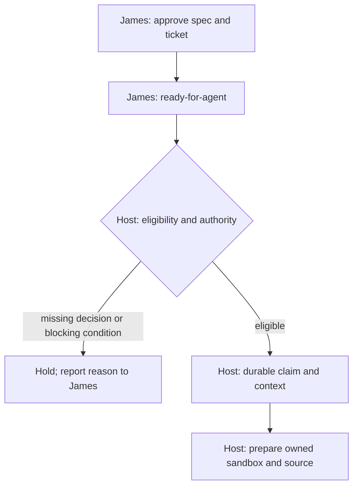
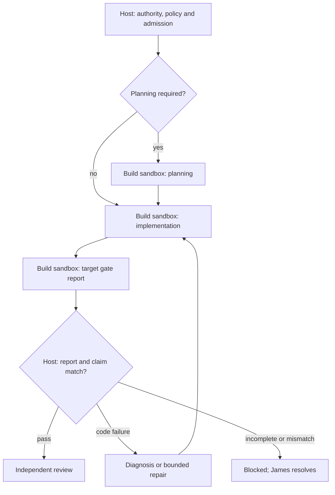
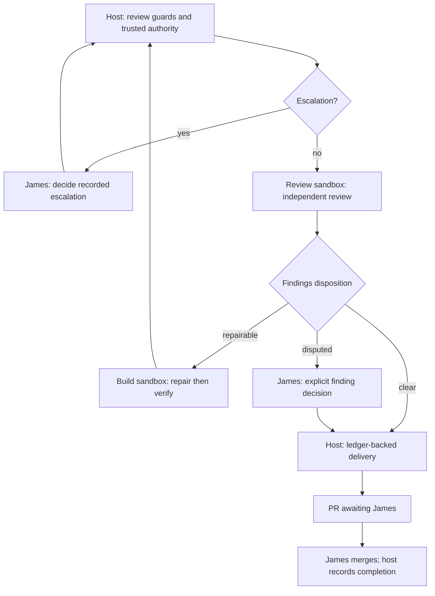
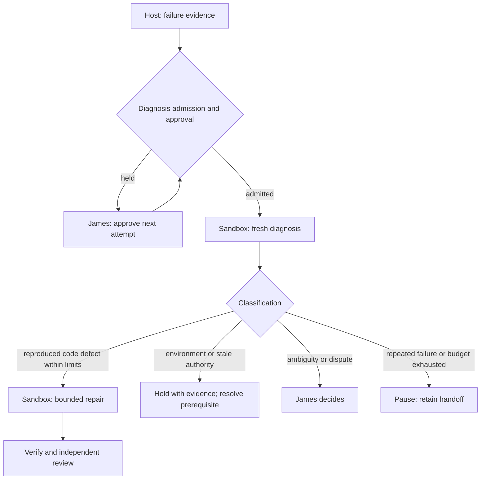
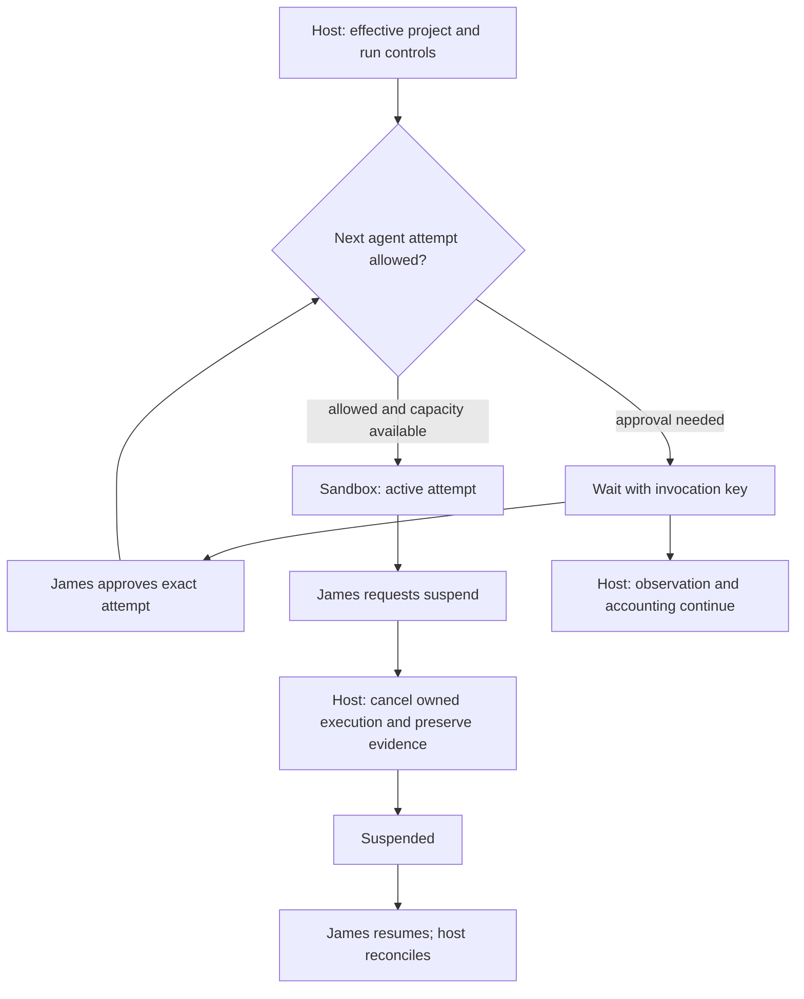
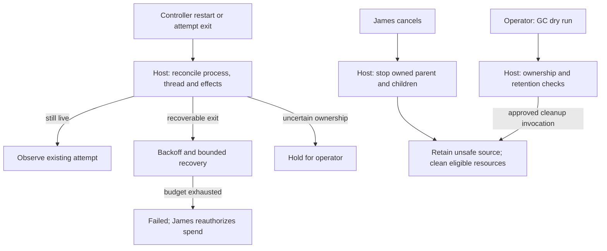
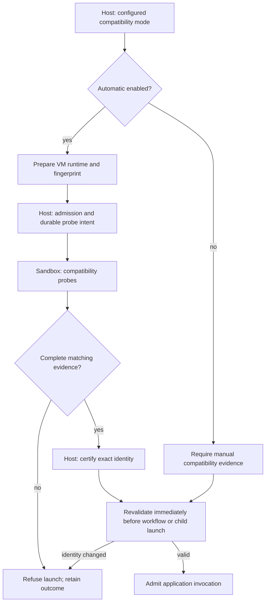
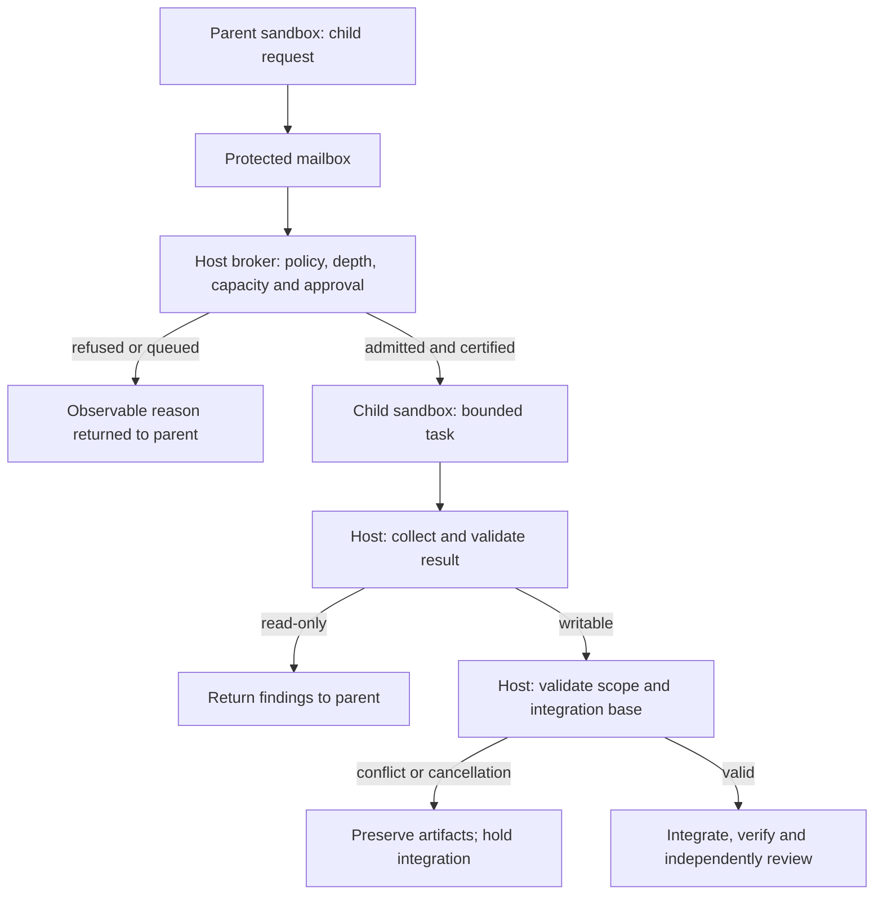
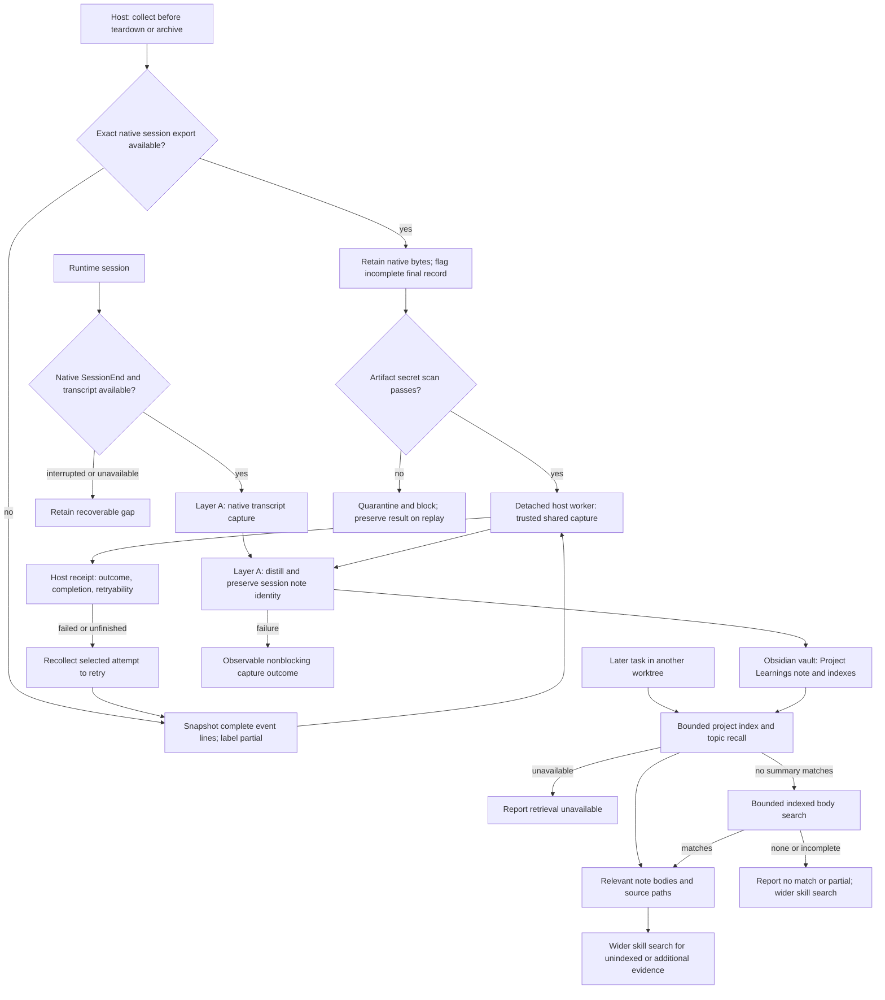

# Workflow reference

Current guidance, audited against the checked-in interfaces on 2026-09-08. These are
operational flows, not a replacement specification or a claim that every project has
activated optional features. Host means the factory control plane; sandbox means an
owned build, review or child execution environment. James nodes mark human decisions.
Each diagram is also available as a rendered SVG for readers without Mermaid support.

The pure [transition table](../src/factory/machine.py), [policy](../src/factory/policy.py)
and [driver](../src/factory/driver.py) govern legal state changes. Every nonterminal
state may block or be cancelled; the diagrams omit those repeated edges for readability.
`completed` and `cancelled` are terminal. `blocked`, `suspended`, `failed` and
`awaiting_human` require a human to move forward.

## Intake and readiness

James approves specification and ticket, then applies `ready-for-agent`. Read-only `run --check` evaluates eligibility without claiming. The host checks tracker/team/repository identity, blocking labels, acceptance criteria, parent authority and duplicate work. Claims and tracker writes use the effects ledger.



Mermaid source


```mermaid
flowchart TD
  H[James: approve spec and ticket] --> L[James: ready-for-agent]
  L --> E{Host: eligibility and authority}
  E -->|missing decision or blocking condition| B[Hold; report reason to James]
  E -->|eligible| C[Host: durable claim and context]
  C --> S[Host: prepare owned sandbox and source]
```

## Implementation and verification

The host freezes policy and selects optional planning or implementation. Build work runs in the sandbox. The host collects results and commits work before invoking the target vendored gate report with the run base. A pass requires matching evidence; incomplete reports and evidence mismatches block.



Mermaid source


```mermaid
flowchart TD
  H[Host: authority, policy and admission] --> P{Planning required?}
  P -->|yes| PL[Build sandbox: planning]
  P -->|no| I[Build sandbox: implementation]
  PL --> I
  I --> V[Build sandbox: target gate report]
  V --> E{Host: report and claim match?}
  E -->|pass| R[Independent review]
  E -->|code failure| D[Diagnosis or bounded repair]
  D --> I
  E -->|incomplete or mismatch| B[Blocked; James resolves]
```

## Review and delivery

Independent review uses trusted target instructions and isolated reviewer source. Escalations and disputed findings require James. The host records external effects before delivery; the declared nemoclaw-dev proxy delivery exception remains project-specific. Awaiting human can also mean a pre-delivery escalation, so it does not always imply a PR exists.



Mermaid source


```mermaid
flowchart TD
  H[Host: review guards and trusted authority] --> G{Escalation?}
  G -->|yes| J[James: decide recorded escalation]
  J --> H
  G -->|no| R[Review sandbox: independent review]
  R --> F{Findings disposition}
  F -->|repairable| I[Build sandbox: repair then verify]
  I --> H
  F -->|disputed| B[James: explicit finding decision]
  F -->|clear| D[Host: ledger-backed delivery]
  B --> D
  D --> A[PR awaiting James]
  A --> M[James merges; host records completion]
```

## Diagnosis and repair

Diagnosis is a workflow/invocation, not an extra machine state. It separates code defects from environment faults, stale authority and ambiguous requirements. Automatic repair requires a reproducible failure and respects episode, lifetime and spend limits; review disputes stay human-owned.



Mermaid source


```mermaid
flowchart TD
  F[Host: failure evidence] --> A{Diagnosis admission and approval}
  A -->|held| J[James: approve next attempt]
  J --> A
  A -->|admitted| D[Sandbox: fresh diagnosis]
  D --> C{Classification}
  C -->|reproduced code defect within limits| R[Sandbox: bounded repair]
  R --> V[Verify and independent review]
  C -->|environment or stale authority| E[Hold with evidence; resolve prerequisite]
  C -->|ambiguity or dispute| H[James decides]
  C -->|repeated failure or budget exhausted| B[Pause; retain handoff]
```

## Approvals and suspension

Approval mode holds the next agent attempt, while deterministic observation and accounting continue. Invocation approvals use the exact recorded key. Suspend is a separate human action that stops owned active work and preserves recovery state. Project changes do not rewrite frozen run selections.



Mermaid source


```mermaid
flowchart TD
  P[Host: effective project and run controls] --> A{Next agent attempt allowed?}
  A -->|approval needed| W[Wait with invocation key]
  W --> J[James approves exact attempt]
  J --> A
  A -->|allowed and capacity available| S[Sandbox: active attempt]
  S --> U[James requests suspend]
  U --> H[Host: cancel owned execution and preserve evidence]
  H --> Q[Suspended]
  Q --> R[James resumes; host reconciles]
  W --> O[Host: observation and accounting continue]
```

## Recovery, cancellation and GC

Detached legacy session holders survive controller exit but not reboot, logout or runtime shutdown. Recovery reconciles recorded ownership before restarting. Cancellation may delete unpushed work: preserve valuable commits first. Cleanup refuses resources with uncertain ownership and retains unsafe debris with a reason.



Mermaid source


```mermaid
flowchart TD
  X[Controller restart or attempt exit] --> R[Host: reconcile process, thread and effects]
  R -->|still live| O[Observe existing attempt]
  R -->|recoverable exit| B[Backoff and bounded recovery]
  R -->|uncertain ownership| H[Hold for operator]
  B -->|budget exhausted| F[Failed; James reauthorizes spend]
  J[James cancels] --> C[Host: stop owned parent and children]
  C --> K[Retain unsafe source; clean eligible resources]
  G[Operator: GC dry run] --> E[Host: ownership and retention checks]
  E -->|approved cleanup invocation| K
```

## Runtime certification

Manual compatibility remains the default absent automatic certification configuration. Automatic certification fingerprints the actual executing sandbox, full runtime/helper package, mounts, environment, authority and probe implementation. Paid probes use durable intent and admission; changed identity or incomplete evidence refuses launch. Certification measures runtime behavior, not product correctness.



Mermaid source


```mermaid
flowchart TD
  H[Host: configured compatibility mode] --> M{Automatic enabled?}
  M -->|no| C[Require manual compatibility evidence]
  M -->|yes| P[Prepare VM runtime and fingerprint]
  P --> A[Host: admission and durable probe intent]
  A --> S[Sandbox: compatibility probes]
  S --> E{Complete matching evidence?}
  E -->|no| B[Refuse launch; retain outcome]
  E -->|yes| V[Host: certify exact identity]
  V --> L[Revalidate immediately before workflow or child launch]
  C --> L
  L -->|identity changed| B
  L -->|valid| W[Admit application invocation]
```

## Child delegation

Delegation defaults to disabled and supports depth one. The host broker owns admission, approvals, invocation accounting and cancellation. Read-only children cannot write parent source; writable children need explicit mode and private source/dependency isolation. Integration preserves originals and conflicts, then normal verification and independent review apply.



Mermaid source


```mermaid
flowchart TD
  P[Parent sandbox: child request] --> M[Protected mailbox]
  M --> H[Host broker: policy, depth, capacity and approval]
  H -->|refused or queued| Q[Observable reason returned to parent]
  H -->|admitted and certified| C[Child sandbox: bounded task]
  C --> R[Host: collect and validate result]
  R -->|read-only| A[Return findings to parent]
  R -->|writable| I[Host: validate scope and integration base]
  I -->|conflict or cancellation| K[Preserve artifacts; hold integration]
  I -->|valid| V[Integrate, verify and independently review]
```

## Learning capture and recall

Layer A owns note writing, indexing and recall; Factory owns lifecycle coordination and
retained evidence. Native session-end hooks consume runtime transcripts when available.
Factory exports native session records before teardown and independently schedules host
recovery after collection or terminal reconciliation, falling back to partial retained events. Both target Markdown notes under the configured Obsidian vault's
`Project Learnings/`, with stable session identity; partial evidence preserves an existing
session note. Receipts distinguish unavailable, failed, unfinished and completed capture.

The [operator learning reference](operator-reference.md#learning-capture-and-relevant-recall)
explains configuration and recovery. [Host measurement](discovery/learning-repair-2026-09-08.md)
proves capture and later worktree recall, while [lifecycle acceptance](acceptance/learning-lifecycle-2026-09-08.md)
proves retained-event transport separately. Later interactive and native sandbox measurements
are linked from the [current handoff](handoff-ui-learning-docs.md); do not infer those paths
from the earlier host-only measurements.



Mermaid source


```mermaid
flowchart TD
  S[Runtime session] --> T{Native SessionEnd and transcript available?}
  T -->|yes| N[Layer A: native transcript capture]
  T -->|interrupted or unavailable| U[Retain recoverable gap]
  H[Host: collect before teardown or archive] --> J{Exact native session export available?}
  J -->|yes| K[Retain native bytes; flag incomplete final record]
  J -->|no| P[Snapshot complete event lines; label partial]
  K --> Q{Artifact secret scan passes?}
  Q -->|yes| W[Detached host worker: trusted shared capture]
  Q -->|no| ZQ[Quarantine and block; preserve result on replay]
  P --> W
  W --> R[Host receipt: outcome, completion, retryability]
  R -->|failed or unfinished| X[Recollect selected attempt to retry]
  X --> P
  N --> D[Layer A: distill and preserve session note identity]
  W --> D
  D --> V[Obsidian vault: Project Learnings note and indexes]
  D -->|failure| F[Observable nonblocking capture outcome]
  L[Later task in another worktree] --> I[Bounded project index and topic recall]
  V --> I
  I --> C[Relevant note bodies and source paths]
  I -->|unavailable| E[Report retrieval unavailable]
  I -->|no summary matches| B[Bounded indexed body search]
  B -->|matches| C
  B -->|none or incomplete| Z[Report no match or partial; wider skill search]
  C --> QS[Wider skill search for unindexed or additional evidence]
```

## Interface and evidence map

| Surface | Checked-in authority |
| --- | --- |
| CLI commands and settings | [CLI parser](../src/factory/cli.py), [configuration CLI](../src/factory/configuration_cli.py) |
| Runs `/`, projects `/projects`, details `/runs/{ticket}`, timeline `/runs/{ticket}/timeline`, settings `/settings/runs/{ticket}`, runtimes `/runtimes`, configuration `/config` | [Console routes](../src/factory/console/app.py) |
| Registry, model routing and estimate inputs | [Projects](../config/projects.toml), [models](../config/models.toml), [prices](../config/prices.toml) |
| Recovery and approvals | [Recovery](../src/factory/recovery.py), [operator controls](../src/factory/operator_controls.py) |
| Certification and child ownership | [Certification runner](../src/factory/certification_runner.py), [delegation controller](../src/factory/delegation_controller.py) |
| Boundary regression checks | [Boundary tests](../tests/unit/test_boundaries.py) |
| Real measurements and their limits | [Acceptance inventory](runtime-acceptance-inventory.md), [documentation classification](README.md) |

Use the [operator reference](operator-reference.md) for command examples and the
[runbook](runbook.md) before changing a stopped run. Context occupancy, cumulative tokens,
API-equivalent estimated USD and incomplete evidence remain distinct throughout the console.
